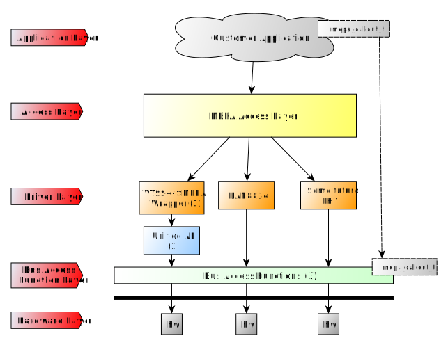

// Copyright (c) 2004-2020 Microchip Technology Inc. and its subsidiaries.
// SPDX-License-Identifier: MIT

:sectnumlevels: 5
:toclevels: 5

= Introduction to MEPA

== Introduction

The Microchip Ethernet PHY API (MEPA) provides a production quality
comprehensive C library supporting all the Ethernet PHYs.
The MEPA library is OS agnostic. The MEPA product is designed as a library, meaning that
it needs to be integrated with an application which owns the API instance.
// More on this in the link:#mepa/docs/getting-started[Getting Started] section.

The following is a list of important properties of MEPA:

Thread safe:: All API access will be serialized (assuming the
`mepa_callout_t::lock_enter` and `mepa_callout_t::lock_exit`
functions are provided).

Non-allocating:: Once the API is instantiated, it will never need to allocate
more memory.

Single-instance:: One MEPA instance is required per PHY.
As an example, a Quad-PHY device requires 4 instances.

OS and CPU agnostic:: Supports multiple operating systems and CPUs.

=== Application support

The MEPA product is targeting customers who either a) have an existing
application or b) are developing a new application and want to integrate
support for one or more ethernet PHYs. The effort of such
an integration depends heavily on the desired feature set in the end product
and on how well the existing application aligns with the APIs offered by MEPA.

== Architecture

MEPA is a C library offering a unified driver interface to configure and query
status in the HW. When the application instantiates the API, it must provide a
set of callback functions to perform register access, synchronization (just a
mutex), traces etc. Once instantiated, the application will call the API
functions to configure or query status.

MEPA architecture is explained by the following layers of abstraction:

MEPA Access Layer:: Provides the public `mepa` header files which should be
included and used by the application. The Access layer then calls into the
driver layer through the appropriate function pointer. Refer to
`mepa/include/microchip/ethernet/phy/api/phy.h` and
`mepa/include/microchip/ethernet/phy/api/phy_ts.h` for the MEPA public methods.

Driver Layer:: Based on the API called, the driver will perform the necessary
register accesses. Refer to `mepa/common/include/mepa_driver.h` and
`mepa/common/include/mepa_ts_driver.h`.
`mepa_driver_t` structure represents PHY APIs.
`mepa_ts_driver` structure represents PHY Timestamping APIs.

Bus Access Functions Layer:: These are the function pointers
which the MEPA access and driver layers use to communicate to the device.
The API uses these function
pointers to call out to do register read/write, acquire/release
mutexes, do traces, sleeps, etc. These components needs to be provided by the
OS/application when instantiating the API. For further details on bus access
functions, refer to the MEPA structure `mepa_callout_t`.

These layers are illustrated in figure below.

.MEPA Layers Overview

. VTSS to MEPA Wrapper is a conversion layer between Unified API and MEPA
access layer.
. Unified API is intended to cover both PHYs and Switches. PHY only users can
do one instance to cover all the PHYs on the board.
//TODO - Add history of Unified API
. Bus Access functions - Customers need to pass their own board specific
APIs for register access or miim accessor functions.

=== Detailed explanation with examples
When using MEPA APIs, the Application is responsible for the allocation of a
MEPA driver structure which will contain device pointers that point to the
corresponding API function pointers.

A snippet is shown below:
[source,c++,linenums]
----
   mepa_drivers_t phy_lib[PHY_FAMILIES] = {};
   phy_lib[0] = mepa_mscc_driver_init();     // Legacy VSC Tesla, Viper, etc.
   phy_lib[1] = mepa_lan8814_driver_init();  // Indy
----
As a minimum, Each PHY driver needs to implement the following methods for
configuration:

[none]
* `mepa_create()`
* `mepa_poll()`
* `mepa_conf_set()`

At the time of Application Initialization, based on phy id, the application
will initialize the structure and register/connect the functions to the
corresponding device pointers, based upon the PHY device which is found in
the probing of the device. Subsequently, all the API calls will be routed
to corresponding PHY API.

Each phy has its own entry point function which contains phy id information
and all the API function pointers that can be used with the PHY.  The
application may call any of the API function which has a valid pointer,
therefore if the functionality does not exist, a NULL will be returned.
Therefore, the Application may need to check function pointer validity prior to
usage.

An example of the registration for the Legacy VSC PHYs(VSC8574/Tesla,
VSC8584/Viper..etc) can be found in the API function `mepa_mscc_driver_init`
and registration for LAN8814/Indy is found in the `mepa_lan8814_driver_init`.
To link each port to its corresponding MEPA driver, the phy id needs to be
detected from IEEE standard registers 2,3.

This detected phy id and corresponding phy id information from the entry point
function are compared to determine if this is a matching phy driver. Once
matched, the function registered for `mepa_create()` API will need to be
called by the application and passing necessary information for access.
The registered probe function for the Indy PHY is: `indy_probe` located
in: `<mepa/src/microchip/lan8814.c>`. while the corresponding probe function
for VSC8574 is `mscc_1g_probe` located in: `<mepa/src/vtss.c>`.

The probe API allocates memory for PHY device which contains state information
, access information, etc. and returns the pointer to the allocated device
structure that contains this information. This device pointer, which is
returned, needs to be stored for the corresponding port as this will be used
with each access. When the application executes the PHY API calls, this device
 pointer for corresponding port would be used. Examples of this can be found
in: `<meba/src/drivers/phy.c>`.
There is also an additional linking of the base port to the other ports on the
PHY and this is accomplished using `mepa_driver_link_base_port_t` API.

The Lan8814/Indy API uses miim controller to access registers. As part of
`mepa_create()` arguments, miim-controller, port miim address, callbacks
 for miim_read and miim_write need to be passed for register access.
synchronization callbacks for lock_enter and lock_exit need to be passed.
Trace callbacks can be passed in trace_func.

=== Directory layout

The MEPA package includes the following sources.

[none]
* `./.cmake` build and scripts.
* `./CMakeLists.txt` CMake project file. Use this to build the sources.
* `include` The MEPA include path.
* `./vtss/include` The MEPA unified API include path.
* `./<phy_family>/<driver>` The MEPA PHY drivers path.
* `./include/microchip/ethernet/phy/api.h` MEPA top header file. Application
  accessing MEPA should include this file.

=== Synchronous design

MEPA is a synchronous library, meaning that it is not capable of generating events
or do anything on its own. MEPA (or the lower layer) does not include any
threads and will not spawn any processes (it can be used in a multi threaded
environment, but all requests will be done one at a time). This means that the
MEPA library can not take the initiative to do anything, and depends on the
application to poll counters, check port status, extract frames etc.

Typically the application will be using a mix of interrupts, timer events, and
frame reception to drive its state-machine, and will then call the `mepa`
functions when needed.

=== API stability

Both MEPA and the Unified-API tries to be API compatible with the previous
release. There are no guarantees, and if nothing is stated in the release note,
then a new version of MEPA/Unified-API should work with existing/older
applications. A simple re-compile is all that is needed.

=== Toolchain and utilities

To integrate MEPA, a cross-toolchain supporting the target CPU is needed. MCHP
provides toolchains supporting the integrated CPUs which can be downloaded from
here http://mscc-ent-open-source.s3-website-eu-west-1.amazonaws.com. The getting
started section will explain how to download and install the correct section.

The provided toolchain is a standard `gcc` based toolchain, build using
`buildroot`. Other toolchains are also expected to work.
