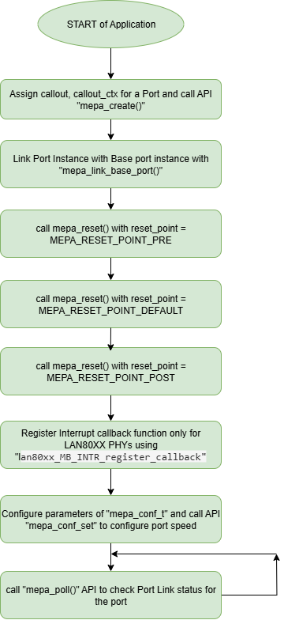

// Copyright (c) 2004-2020 Microchip Technology Inc. and its subsidiaries.
// SPDX-License-Identifier: MIT

= Port Link Up Configuration
== Port Link Up Configuration

The list and order of APIs provided in this document are mandatory for all MEPA-supported PHYs during the initial boot-up configuration.
Once this boot-up sequence is completed for all PHY ports on the board, users are free to call any other APIs to configure additional
PHY modules or modify the port link speed

== Port Link Up Sequence

The expected sequence of APIs to be followed by the application in order to link up the port of any PHY is as follows:

. PHY Instance Create      : `mepa_create()`
. PHY Link Base port       : `mepa_link_base_port()`
. PHY Reset                : `mepa_reset()` All three Reset Points
. PHY Interrupt callback   : `lan80xx_MB_INTR_register_callback` -- Applicable only for LAN80XX PHYs
. PHY Configuration Set    : `mepa_conf_set()`
. PHY Port Status          : `mepa_poll()`

== MEPA Instance Create

MEPA Library operates on Port instances, which represents physical PHY Ports.The MEPA APIs will access PHY through its corresponding port instance.
For Quad Channel PHY, four MEPA Instances needs to be created by the Application to access each channel of the PHY through its corresponding Instance.

For MEPA to configure/query a given PHY, it needs to access the registers inside the PHY.To access PHY registers, some kind of bus-controller is needed (MIIM/SPI),
and if it is a shared bus, some addresses are needed.To keep MEPA board and OS agnostic,a set of call-back functions facilitating register access must be provided
when creating a MEPA instance (`mepa_callout_t`).

A given board may have multiple buses, multiple PHYs, which lead to board specific needs for addressing a given PHYs.
To avoid board dependencies in MEPA, all the callback functions therefore have a struct `mepa_callout_ctx`.

Both `mepa_callout_t` and `mepa_callout_ctx` object pointers are considered as shared pointers.
Multiple Port instance `mepa_device_t` may use same `mepa_callout_t` object(PHYs on same bus must use same `mepa_callout_t` as they all share the same bus resources)
and each Port instance must have its own unique `mepa_callout_ctx`

The creation of MEPA instances must be initiated by the application. A MEPA instance is established through the invocation of
the `mepa_create()` function. Upon successful execution, this function returns a pointer to `mepa_device_t`.

The `mepa_device_t` serves as a representation of an individual PHY and is essential for the operation of all subsequent
MEPA API calls pertaining to that specific PHY.To Create MEPA Instance `mepa_callout`, `mepa_callout_ctx` and `mepa_board_conf_t`
are the necessary params. For Each Port of the PHY Seperate Software Instance is created.

----

struct mepa_device *mepa_create (const mepa_callout_t    MEPA_SHARED_PTR *callout,
                                 struct mepa_callout_ctx  MEPA_SHARED_PTR *callout_ctx,
                                 struct mepa_board_conf_t   *conf);

----

API 'mepa_create' will check for the PHY connected on the port by reading SKU ID of the PHY and map corresponding PHY MEPA Driver to the Port Instance.

image::mepa-layers-overview.svg[align="center"]

== Link Base Port

In Multi-Port PHYs, there will be common or shared resources among the PHY ports, these resources must be accessed by the Base Port Instance of the PHY,
so it is necessary to link all the Port instances of one PHY to its corresponding base port instance.These resources are allocated as part of the first PHY port (base port) of the chip,
all other Ports of the PHY will be Linked to this Base Port using the MEPA API `mepa_link_base_port()` to access the common chip-level resourses of the PHY.

----

mepa_rc mepa_link_base_port (struct mepa_device    *dev,
                             struct mepa_device    *base_dev,
                             uint8_t               packet_idx);
----

NOTE: Generally its suggested that the first port of the PHY to be configured by the application will be set as a Base port of the PHY, irrespective of PHY channel number

== Reset Configuration

Reset API is expected to be the first API to do Hardware Configuration in the PHY once the PHY is Powered Up and it
is mandatory for all the PHYs in order to do the Chip Reset, update the Microcontroller Configurations and to get all
the Workarrounds Applied to the PHY.

`mepa_reset()` API has three Reset Points and all the reset points to be called consecutively in the following sequence.

. `MEPA_RESET_POINT_PRE`
. `MEPA_RESET_POINT_DEFAULT`
. `MEPA_RESET_POINT_POST`

All the Reset points should be called for all the Ports of the PHY in the above sequence at the start of Application.
User can call `MEPA_RESET_POINT_DEFAULT` Reset point anytime to change the Media Interface type after initial configuration. After
Reset User can call `mepa_conf_set()` API to Configure or Modify the Port Configurations.

== Port Config through Conf_Set
Once `mepa_reset()` is done and successful, port needs to be configured using `mepa_conf_set()` with the appropriate configurations.
These configurations mainly include speed, flow control , Aneg Configs, Duplex, media type and channel configuration. If Auto - Negotiation
is selected then user can configure the Aneg advertise capabilities through this MEPA API.

There are multiple Arguments in `mepa_conf_t` structure where many of the arguments are specific to particular type of PHY it will not be used
by other PHYs.

The arguments available in `mepa_conf_t` and which arguments are supported by which PHYs are listed in the following table.
User is Expected to follow this table and do the necessary configuration for the corresponding PHY.

----
mepa_rc  mepa_conf_set(struct mepa_device  *dev,
                       const mepa_conf_t   *conf);
----

[cols="1,1", options="header"]
|===
|Arguments of `mepa_conf_t`
| Supported By

| speed
| All PHYs

| fdx
| VSC 1G PHYs,  LAN88XX, LAN80XX

| flow_control
| VSC 1G PHYs,  LAN88XX

| adv_dis
| Not Used by MEPA, used by MEBA

| admin
| VSC 1G PHYs,  LAN88XX

| aneg
| VSC 1G PHYs,  LAN88XX, LAN80XX

| mac_if_aneg_ena
.3+| VSC 1G PHYs,  LAN88XX,

| man_neg

| mdi_mode

| force_ams_mode_sel
| VSC 1G PHYs

| conf_10g
| VSC 10G PHYs

| conf_25g
| LAN80XX PHYs
|===

Following table will provide the short Description about different arguments available in `mepa_conf_t` structure.

[cols="1,1", options="header"]
|===
| Argument           | Description
| speed              | Port Speed to be Configured, select `MESA_SPEED_AUTO` if Aneg
| fdx                | Full Duplex or Half Duplex
| flow_control       | Enable or Disable Flow Control
| adv_dis            | Disable Aneg Advertisements used by MEBA layer
| admin              | Admin access to change all the Aneg abilities in MEBA Layer
| aneg               | Auto Negotiation Advertise Abilities
| mac_if_aneg_ena    | Enable auto-negotiation on host mac interface
| man_neg            | To chose the current PHY port needs to be in master or slave in ANEG mode for 1G
| mdi_mode           | MDI/MDIX/Auto Mode to select crossover and polarity detection
| force_ams_mode_sel | Serdes Media or Copper Media or Auto - Based on AMS the media mode will be selected
| conf_10g           | Mode and Media Configuration of VSC 10G PHYs
| conf_25g           | Channel ID, Media ,Aneg Abilites and FEC Config of LAN80XX 25G PHY
|===

To configure the VSC 10G PHYs the argument `conf_10g` of `mepa_conf_t` needs to be configured following table provides the
breakdown the argument `phy10g_conf_t` with Short Description of each argument.

[cols="1,1", options="header"]
|===
| Arguments of `phy10g_conf_t`                | Description
| oper_mode - `phy10g_oper_mode_t`            | Phy Operating Mode based on Speed
| interface_mode  - `phy10g_interface_mode_t` | Phy Interface, this will vary for different SKUs of various VSC 10G PHYs
| channel_id                                  | Channel Number of the PHY Port
| h_media  - `phy_media_t`                    | Host side Media Connected
| l_media  - `phy_media_t`                    | Line side Media Connected
| channel_high_to_low                         | If Channel id decreasing order w.r.t port number increasing then set this to `1`
| xfi_pol_invert                              | Selects polarity to the TX XFI data. 1:Invert 0:Normal
| xaui_lane_flip                              | Swaps XAUI Lane 0 <--> 3 and 1 <--> 2 for both RX/TX for Venice PHY family
| polarity - `phy_10g_polarity_inv_t`         | polarity inversion configuration
| hl_clk_synth                                | 0: Free running clock  1: Hitless clock
| is_host_wan                                 | HOST WAN/LAN Selection for SerDes config
| lref_for_host                               | Clock source selection HREF or LREF on HOST side
| h_clk_src_is_high_amp                       | Host H_PLL5G Amplitude selection HIGH or LOW
| l_clk_src_is_high_amp                       | Line L_PLL5G Amplitude selection HIGH or LOW
|===

MEPA Supports different Host Side and Line Side Media Connections provided in `phy10g_media_t`, but VSC 10G PHYs will only support
following Media.

. MEPA_MEDIA_TYPE_SR_SC +
. MEPA_MEDIA_TYPE_SR2_SC +
. MEPA_MEDIA_TYPE_DAC_SC
. MEPA_MEDIA_TYPE_ZR_SC
. MEPA_MEDIA_TYPE_ZR2_SC
. MEPA_MEDIA_TYPE_KR_SC

To configure the LAN 25G PHYs(LAN8044) the argument `conf_25g` of `mepa_conf_t` needs to be configured following table provides the
breakdown the argument `conf_25g` with Short Description of each argument.

[cols="1,1", options="header"]
|===
| Arguments of `conf_25g`                     | Description
| channel_id                                  | Channel ID of the PHY Port
| line_media                                  | Line side Media Connected
| host_media                                  | Host side Media Connected
| polarity                                    | Tx and Rx Polarity Inverse Config
| kr_train_enable                             | Enable KR Training
| base_r_10gfec                               | Advertise Base-R FEC at 10G Speed
| base_r_25gfec                               | Advertise Base-R FEC at 25G Speed
| rs_fec_25g                                  | Advertise RS-FEC
| np_base_r_fec                               | Advertise Next Page Base-R FEC
| np_rs_fec                                   | Advertise Next Page RS-FEC
|===

MEPA Supports different Host Side and Line Side Media Connections provided in `phy_media_t`, but LAN 25G PHYs will only support
following Media.

. MEPA_MEDIA_TYPE_SR               -- SFP+ SR / 1000BASE-SX +
. MEPA_MEDIA_TYPE_LR               -- SFP+ LR / 1000BASE-LX +
. MEPA_MEDIA_TYPE_ER               -- SFP+ ER / 1000BASE-EX +
. MEPA_MEDIA_TYPE_DAC              -- SFP+ DAC +
. MEPA_MEDIA_TYPE_SFP28_25G_SR     -- SFP28 SR +
. MEPA_MEDIA_TYPE_SFP28_25G_LR     -- SFP28 LR +
. MEPA_MEDIA_TYPE_SFP28_25G_ER     -- SFP28 ER +
. MEPA_MEDIA_TYPE_SFP28_25G_DAC1M  -- SFP28 DAC 1M +
. MEPA_MEDIA_TYPE_SFP28_25G_DAC2M  -- SFP28 DAC 2M +
. MEPA_MEDIA_TYPE_1000BASE_T       -- 1000BASE-T  //Enables 1000BASE-T SGMII +

Following is sample source code to configure Channel 3 of LAN8044 PHY in 25G Speed and Enable RS-FEC on HOST side alone:

----

mepa_conf_t  conf = {0};

mepa_conf_get(dev , &conf);

conf.speed = MESA_SPEED_25G;  /* 25G Speed */
conf.fdx = 1;
conf.conf_25g.polarity.line_tx = 0;
conf.conf_25g.polarity.line_rx = 0;
conf.conf_25g.polarity.host_tx = 0;
conf.conf_25g.polarity.host_rx = 0;
conf.conf_25g.line_media = MEPA_MEDIA_TYPE_SFP28_25G_SR;
conf.conf_25g.host_media = MEPA_MEDIA_TYPE_SFP28_25G_DAC1M;
conf.conf_25g.rs_fec_25g = 1;                                         /* Enable RS-FEC */
conf.aneg.advertise_dir = MEPA_ADV_SIDE_HOST;  /* Enable RS-FEC in HOST */
conf.conf_25g.channel_id = MEPA_CHANNELID_3;

mepa_conf_set(dev, &conf);

----

== PHY Status Poll

Once the Forced Configuration oe Auto_negotiation is completed the Link Status of the Port can be retrieved by Polling MEPA API
`mepa_poll()` which will provide the Link Status (Up/Down), Port Speed and Aneg Status.

== Mailbox Interrupt callback for LAN80XX PHYs

`lan80xx_MB_INTR_register_callback()` this function pointer is exposed to customer application which is expected to read the HOST Intrupt line,
which connects the GPIO34/GPIO35 of LAN80XX GPIO aggregate interrupt pins.

User needs to register this callback function to read the HOST interrupt line and return the pin status as either TRUE or FALSE.

NOTE: This INTR callback function is applicable only for LAN80XX PHYs and it is expected to register this callback function for the base-port PHY instance.

== Sample Port LinkUp Configuration

Refer ADOC link:mepa-app-doc.html#mepa_demo/docs/port-config[Port - Confiuration] section for sample application.

Suppose User has a ethernet switch with following Microchip PHYs connected

* `One VSC8584 = Viper PHY (Quad PHY) [Switch Port 0,1,2,3]`
* `One VSC8258 = Malibu10G PHY (Quad PHY) [Switch Port : 4,5,6,7]`
* `One LAN8044 = Malibu25G PHY (Quad PHY) [Switch Port : 8,9,10,11]`

----

uint8_t gpio_callback(void)
{
    /* callback function to read the GPIO Pin of the User HOST which connects to Aggregate Interrupt Pin of LAN8044 PHY */
    return val;
}

vtss_inst_t vtss_instance = NULL;
mepa_device_t *phy_dev_backup[12];
uint8_t base_port_num[12] = {0,0,0,0,4,4,4,4,8,8,8,8};

/* User application callouts */

mepa_callout_t mepa_callout = {
    .mmd_read        = APPL_mmd_read,
    .mmd_read_inc    = APPL_mmd_read_inc,
    .mmd_write       = APPL_mmd_write,
    .miim_read       = APPL_miim_read,
    .miim_write      = APPL_miim_write,
    .spi_read        = APPL_spi_read,
    .spi_write       = APPL_spi_write,
    .spi_read_64bit  = APPL_spi_read_64bit,
    .spi_write_64bit = APPL_spi_write_64bit,
    .lock_enter      = APPL_lock_enter,
    .lock_exit       = APPL_lock_exit,
    .mem_alloc       = APPL_mem_alloc,
    .mem_free        = APPL_mem_free
};

for (uint8_t port_no = 0; port_no < 12; port_no++)
{
    mepa_board_conf_t board_conf = {};
    board_conf.numeric_handle = port_no;
    mepa_callout_ctx_t mepa_callout_ctx;
    mepa_callout_ctx.inst = 0;
    mepa_callout_ctx.port_no = port_no;
    mepa_callout_ctx.meba_inst = <User Board Instance>;
    mepa_callout_ctx.miim_controller = <Board MIIM Controller>;
    mepa_callout_ctx.miim_addr = <MIIM PHY Address>;

    struct mepa_device *phy_dev = mepa_create(&mepa_callout, &mepa_callout_ctx, &board_conf);
    if (phy_dev == NULL) {
        printf(stderr, "Failed to create MEPA device for port %u\n", port_no);
        continue;
    }

    if (phy_dev != NULL) {
        phy_dev_backup[port_no] = phy_dev;
        vtss_instance = board_conf.vtss_instance_ptr;
    }
}

for (uint8_t port_no = 0; port_no < 12; port_no++)
{
    if (phy_dev_backup[port_no] == NULL) {
        continue; // Skip uninitialized devices
    }

    (void)mepa_link_base_port(phy_dev_backup[port_no], phy_dev_backup[base_port_num[port_no]], 0);

    mepa_phy_info_t phy_info = {0};
    mepa_reset_param_t phy_reset = {0};

    phy_reset.media_intf = MESA_PHY_MEDIA_IF_CU; /* No use of this argument for LAN8044 PHY */
    /* Pre Reset Configuration */
    phy_reset.reset_point = MEPA_RESET_POINT_PRE;
    mepa_phy_reset(phy_dev_backup[port_no], port_no, &phy_reset);

    /* Default Reset Point */
    phy_reset.reset_point = MEPA_RESET_POINT_DEFAULT;
    mepa_phy_reset(phy_dev_backup[port_no], port_no, &phy_reset);

    /* Post Reset Point */
    phy_reset.reset_point = MEPA_RESET_POINT_POST;
    mepa_phy_reset(phy_dev_backup[port_no], port_no, &phy_reset);

    mepa_phy_info_get(phy_dev_backup[port_no], port_no, &phy_info);

    if (phy_info.part_number == 0x8044) {
        lan80xx_MB_INTR_register_callback(phy_dev_backup[port_no], gpio_callback);
    }

    switch (phy_info.part_number) {
    case 0x8258:
        /* mepa_conf_set() API configuration for Malibu10G PHY */
        break;
    case 8584:
        /* mepa_conf_set() API configuration for Malibu10G PHY */
        break;
    case 0x8044:
        /* mepa_conf_set() API configuration for Malibu25G PHY */
        break;
    }
}

----

== PHY Boot-up Flow Diagram

