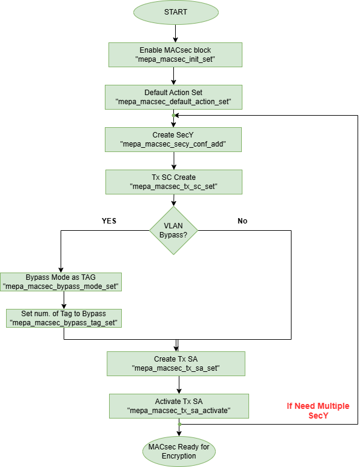
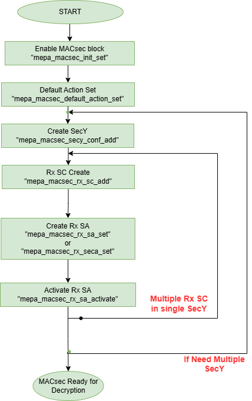

// Copyright (c) 2004-2020 Microchip Technology Inc. and its subsidiaries.
// SPDX-License-Identifier: MIT

== MACSec description

The Media Access Control Security (MACsec) standard (IEEE 802.1AE-2006) defines data confidentiality
and integrity for data. MACsec allows authorized systems on an interconnected LAN to ensure
confidentiality of data and to monitor frames coming from unauthorized device and take corrective
measures.

This API provides a management interface to SecY entities, described on clause 10 of 802.1AE.

[cols="1,9"]
|===
|Term | Description

|SecY
|As defined by the 802.1AE standard, a SecY is the entity that operates the
MACsec protocol on a network port (Phy in this context).  There may be zero or
more SecY instances on any physical port.  A SecY instance is associated with an
Virtual Port.  A SecY contains one transmit SC and zero or more receive SC's.
There is a receive SC for each peer entity on the LAN who is a member of the
connectivity association (CA). SecY's are identified by their SCI (MAC, Virtual
Port).

|SC
|A Secure Channel (SC) represents a security relationship from one member of a
CA to the others. Each SC has a sequence of SA's allowing for replacement of
cryptographic keys without terminating the SC. Each SC has at most 4 active
SA's, the SA within an SC is identified by its association number.  Each receive
SC is identified by it's SCI value in the SecTAG.  Receive SC's are instantiated
by the Key Agreement component when a remote peer joins the CA.  Transmit SC's
are instantiated in the same operation as when a SecY is instantiated and is
destroyed only when the SecY is destroyed.

|SA
|SA's contain cryptographic keying material used for MACsec protection and
validation operations. SA's are periodically updated from the MACsec Manager's
KaY component. An SA is identified by the SC it belongs to and its association
number (AN).

|Common Port
|An instance of the MAC Internal Sublayer Service used by the SecY to provide
transmission and reception of frames for both the controlled and uncontrolled
ports.

|Controlled Port
|The access point used to provide the secure MAC Service to a client of a SecY.
In other words the en/decrypting port.

|Uncontrolled Port
|The access point used to provide the insecure MAC Service to a client of a
SecY. Typically used for EAPOL frames.
|===

=== MACsec Capability

Microchip provides multiple PHY SKUs, where some SKUs supports MACsec, to check whether the PHY connected
on the port supports MACsec or not, the MEPA API `mepa_macsec_is_capable()` returns `TRUE` if PHY supports MACsec else
it will return `FALSE`

MACsec Block supports multiple virtual ports in single physical port of the PHY, each virtual port can have multiple Secure Channels
and Secure Associations to encrypt/decrypt, this depends on the Hardware.

MEPA API `mepa_macsec_secy_cap_get()` is used to get the Maximum number of Secy, SC and SA supported on each physical port of PHY.

----

mepa_rc mepa_macsec_is_capable(struct mepa_device       *dev,
                               const mepa_port_no_t     port_no,
                               mepa_bool_t              *capable);

mepa_rc mepa_macsec_secy_cap_get(struct mepa_device       *dev,
                                 const mepa_port_no_t     port_no,
                                 mepa_macsec_secy_cap_t   *const cap);
----

=== MACSec block initialization

* `mepa_macsec_init_set()`:  is used for enabling, initializing, and setting bypass for the MACSEC block.

When the MACsec block is disabled/bypassed, all frames are passed through unchanged.

The default state of the MACSEC Block, after Phy initialization, is MACsec block is Disabled.
When the MACsec block is enabled, API `mepa_macsec_init_set()` is called with `enable=TRUE`, and 
all frames are dropped until SecY (CA) is created and configured. To initialize the MACSEC block, 
the block must be enabled and the bypass param must be set to: `MEPA_MACSEC_INIT_BYPASS_NONE`, ie. the 
Application must ensure that `mepa_macsec_init_set()` has been called once with bypass param set 
to `MEPA_MACSEC_INIT_BYPASS_NONE` in order for the MACSEC initialization to be completed for the port.

To place the MACSEC block into bypass, the API `mepa_macsec_init_set()` must be called again with 
the bypass param set to: `MEPA_MACSEC_INIT_BYPASS_ENABLE` and to remove the bypass, the API 
`mepa_macsec_init_set()` must be called with the bypass param set to:
`MEPA_MACSEC_INIT_BYPASS_DISABLE`.

----

mepa_rc mepa_macsec_init_set(struct mepa_device          *dev, 
                             const mepa_macsec_init_t    *const macsec_init);

mepa_rc mepa_macsec_init_get(struct mepa_device          *dev,
                             mepa_macsec_init_t          *const macsec_init);
----

[cols="1,1,1", options="header"]
|===
|enable	 | bypass	                           | Description
|1	     | MEPA_MACSEC_INIT_BYPASS_NONE	       | Enables MACsec Block and its clock
|1	     | MEPA_MACSEC_INIT_BYPASS_ENABLE	   | Enables MACsec Block Clock, but it will be in Bypass Mode, packet will bypass MACsec Crypto Engine, the MACsec Configurations will not be Erased.
|1	     | MEPA_MACSEC_INIT_BYPASS_DISABLE	   | Enable MACsec Block from Bypass, so block and crypto will be operational
|0	     | MEPA_MACSEC_INIT_BYPASS_NONE	       | Disable MACsec Block and its clock, the MACsec and resets the MACsec Configurations
|===

NOTE: To enable the MACsec block this API needs to be called with "enable"=TRUE and "bypass"= MEPA_MACSEC_INIT_BYPASS_NONE,
to completely Disable MACsec Block API needs to be called with "enable"=FALSE and "bypass"= MEPA_MACSEC_INIT_BYPASS_NONE.

NOTE: In MACSec operation for certain 10G PHYs, when link down is detected, the
MACSec block should be set to be bypassed until link up is detected, then MACSec
block should be set to be non-bypassed.  When the link is down, there is a CLOCK
Src within the MACSEC Block that is removed and so some Register updates did not
occur. It was not all Register updates, only certain ones. Therefore, putting
the block into BYPASS would prevent further operation as a work-around for this
issue.

Customer application should follow the below psuedo code

    1) On link down
       Check if interface 10G & macsec capable
          If (yes) then check
          if Macsec block is enabled using API mepa_macsec_init_get(), check if init->enable == TRUE
          If (macsec_enabled) then call the API below, to set the BYPASS mode
          API: mepa_macsec_init_set() init struct: mepa_macsec_init_t init;
          init.enable = TRUE;
          init.bypass = MACSEC_INIT_BYPASS_ENABLE;

    2) On link up
       Check if interface is macsec capable
          If (yes) then check
          if Macsec block is enabled using API mepa_macsec_init_get(), check if init->enable == TRUE
          If (macsec_enabled) then call the API below, to remove the BYPASS
          API: mepa_macsec_init_set() init struct: mepa_macsec_init_t init;
          init.enable = TRUE;
          init.bypass = MACSEC_INIT_BYPASS_DISABLE;

Please note that the customer application using bypass mode other than the purpose mentioned above,
should make sure that API `mepa_macsec_init_set()` has been called once with bypass param set to
`MEPA_MACSEC_INIT_BYPASS_NONE`, to initialize the port for MACSEC operation.

If the Application is calling API `mepa_macsec_init_set()` with bypass param set to:
`MEPA_MACSEC_INIT_BYPASS_ENABLE` / `MEPA_MACSEC_INIT_BYPASS_DISABLE`, there is a requirement that macsec init has been completed

=== SECY APIs

Secure Entity operates the MACSec protocol on a network port .There may be zero or more SecY instances
on any physical port. A SecY instance is associated with a Virtual Port. A SecY contains one transmit
Secure Channel (SC) and zero or more receive SC's. There is a receive SC for each peer entity on the LAN,
which is a member of the Connectivity Association (CA). SecY's are identified by their
Secure Channel Identifier (SCI) or by MAC virtual port.

The Cipher Suit of MACsec Engine is Configured through this Secy APIs

[%autowidth.stretch]
|===
| *MEPA APIs* | *Description*

| `mepa_macsec_secy_conf_add()`
| Create a SecY entity of a MACsec port
The entity is created with given parameters
The controlled port is disabled by default and must be enabled before normal processing.

| `mepa_macsec_secy_conf_update()`
|Update the configurations of available SecY entity of a MACsec port
SecY update with new parameters i.e. Replay Window size etc, it will
update only to the SA's to be created newly. Existing parameters i.e. Next PN and Lower PN
will not change for Existing SAs. Tx/Rx SA Status Next PN and Lowest PN shows different
as compare with existing Tx/Rx SA Status.

| `mepa_macsec_secy_controlled_set()`
|Enable/Disable the SecY's controlled (secure) port.
The controlled port is disabled by default.

| `mepa_macsec_secy_port_status_get()`
|Get status from a SecY port, controlled, uncontrolled or common.

|`mepa_macsec_port_get_next()`
|Browse through available macsec ports (secy's/virtual ports) on a physical port
Use NULL pointer to get the first port and use found ports as a search port in the next round.
|===

----

mepa_rc mepa_macsec_secy_conf_add (struct mepa_device                *dev,
                                   const mepa_macsec_port_t          port,
                                   const mepa_macsec_secy_conf_t     *const conf);

mepa_rc mepa_macsec_secy_conf_get(struct mepa_device               *dev,
                                  const mepa_macsec_port_t         port,
                                  mepa_macsec_secy_conf_t          *const conf);

mepa_rc mepa_macsec_secy_conf_update(struct mepa_device              *dev,
                                     const mepa_macsec_port_t        port,
                                     const mepa_macsec_secy_conf_t   *const conf);

mepa_rc mepa_macsec_secy_conf_del(struct mepa_device             *dev,
                                  const mepa_macsec_port_t       port);

mepa_rc mepa_macsec_secy_controlled_set(struct mepa_device          *dev,
                                        const mepa_macsec_port_t    port,
                                        const mepa_bool_t           enable);

mepa_rc mepa_macsec_secy_controlled_get(struct mepa_device          *dev,
                                        const mepa_macsec_port_t    port,
                                        mepa_bool_t                 *const enable);
----

Following are the arguments of structure `mepa_macsec_port_t`

* `port_no`       : Port Number of the PHY, A reference to the physical port

* `service_id`    : A reference to a given encapsulation service. The user of the API may choose 
                    any number, this is not used in hardware, but in cases where external-virtual ports
                    are used this is required to have a unique identifier to a given SecY.

* `port_id`       : The port ID used in the SCI tag, each SecY is identified by this port_id

Following are the arguments of structure `mepa_macsec_secy_conf_t` and its description

[cols="1,1,1", options="header"]
|===
| Arguments	           | Description
| mac_addr	           | Mac address of the Tx SecY (SCI = mac_addr + port_id)
| validate_frames	   | Frame Validation control(Disable/Strict/check)
| replay_protect	   | Enable/Disable Replay Window
| replay_window	       | Replay Window size
| protect_frames	   | Enable/Disable frame protection
| always_include_sci   | Explicit or Implicit SCI
| use_es	           | End Station bit in TCI
| use_scb	           | SCB bit in TCI
| current_cipher_suite | Cipher Suit and key length selection  (XPN or NON-XPN)
|===

=== Classification and Pattern Matching

==== Matching patterns

When traffic passes through the MACsec processing block, it will be matched
against a set of rules/policies, each SecY(Virtual Port) can be configured with a set of Pattern matching Rules using MEPA API `mepa_macsec_pattern_set()`.
If none of these rules/policies match, the traffic will be matched against the default rules/policies.

Note:: There will one and only one of the default rules/policies for a MACsec block and this is defined
in `mepa_macsec_default_action_policy_t` which can be configured through `mepa_macsec_default_action_set()`

The classification rules/policies are associated with a MACsec port and an action. The
action is defined in `mepa_macsec_match_action_t` and defines frame drop and frame forwarding
requirements.  If the frame should be forwarded, it will be forwarded to the controlled(`MEPA_MACSEC_MATCH_ACTION_CONTROLLED_PORT`)
or the uncontrolled port (`MEPA_MACSEC_MATCH_ACTION_UNCONTROLLED_PORT`) of the given virtual MACsec port.

These classification rules are used for both the ingress and the egress traffic.
On the ingress side, only tags located before the SECtag will be processed and used.

These rules are a limited resource, and the HW is limited to allow the same
amount of classification rules as concurrent SA streams. Therefore, to utilize
the hardware 100%, the rules should only be used to associate traffic with the
controlled port (encryption/decryption) of a MACsec port.  If these rules are not being matched,
then the traffic matching falls to the default rules/policies matching.

In simple scenarios where a single peer is connected to a single PHY port,
there are more than sufficient resources to use this mechanism for associating traffic
with the controlled and the uncontrolled port, but the user should be aware that these resources are limited.
It is recommended that resources are always optimized and this is accomplished by
configuring the classification rules for the control port and configuring the default rules/policies
for the uncontrolled port.

Followings are the different Pattern Matching rules:

* Destination MAC Address(match = `MEPA_MACSEC_MATCH_DMAC`) +
* Ether-type (match = `MEPA_MACSEC_MATCH_ETYPE`) +
* 2 VLAN IDs (match = `MEPA_MACSEC_MATCH_HAS_VLAN` or `MEPA_MACSEC_MATCH_HAS_VLAN_INNER`) +

----

mepa_rc mepa_macsec_pattern_set(struct mepa_device                  *dev,
                                const mepa_macsec_port_t            port,
                                const mepa_macsec_direction_t       direction,
                                const mepa_macsec_match_action_t    action,
                                const mepa_macsec_match_pattern_t   *const pattern);

mepa_rc mepa_macsec_pattern_get(struct mepa_device                  *dev,
                                const mepa_macsec_port_t            port,
                                const mepa_macsec_direction_t       direction,
                                const mepa_macsec_match_action_t    action,
                                mepa_macsec_match_pattern_t         *const pattern);

mepa_rc mepa_macsec_pattern_del(struct mepa_device                  *dev,
                                const mepa_macsec_port_t            port,
                                const mepa_macsec_direction_t       direction,
                                const mepa_macsec_match_action_t    action);

----

Note:: Argument `match` of structure `mepa_macsec_match_pattern_t` is of type uin32_t, so we can match for multiple match rules by doing OR operation will all matches

NOTE: This MEPA API `mepa_macsec_pattern_set` doesn't do any chip-level register configuration when `action == MEPA_MACSEC_MATCH_ACTION_CONTROLLED_PORT`, instead it will store
the values in software and use it when creating the next Secure Association, so whenever SA is created these stored values will be used to configure.
If User wants to change the pattern matching rule for next SA, then user needs to call `mepa_macsec_pattern_set()` API before creating Tx or Rx SA
When `action = UNCONTROLLED_PORT` or `action = DROP` this `mepa_macsec_pattern_set()` API will do chip-level register configuration.

[%autowidth.stretch]
|===
| *match_conf.match* | *Parameters of struct `mepa_macsec_match_pattern_t` used*

| MEPA_MACSEC_MATCH_ETYPE
| match_conf.etype =  value of Ether-type to match

| MEPA_MACSEC_MATCH_DMAC
| match_conf.dest_mac = value of DMAC to match

| MEPA_MACSEC_MATCH_VLAN_ID
| match_conf.vid = value of VLAN Tag
match_conf.has_vlan_tag = 1

| MEPA_MACSEC_MATCH_HAS_VLAN_INNER
| match_conf . vid_inner = value of Inner VLAN Tag
match_conf . has_vlan_inner_tag = 1
|===

Instead of using this method to forward control frames to the uncontrolled port,
`mepa_macsec_control_frame_match_conf_set()` can be used to configure the Pattern to Consider the Packet as Control
frames through `mepa_macsec_control_frame_match_conf_t` which will pass the traffic unaffected when the Pattern is matched..

However, this will have the following consequences:

the controlled frames will not be included in uncontrolled port counters. To get the correct counter values,
the application will need to gather all the control frames, calculate the statistics and use this to
Compensate/recalculate the uncontrolled port counters.

Following are different matching rules that `mepa_macsec_control_frame_match_conf_set()` supports:

* Destination MAC Address (DMAC) +
* Ether-type +
* DMAC and Ether-type +

The number of matching rules that each MACsec port supports through `mepa_macsec_control_frame_match_conf_set()` API depends on hardware.

----

mepa_rc mepa_macsec_control_frame_match_conf_set(struct mepa_device                              *dev,
                                                 const mepa_port_no_t                            port_no,
                                                 const mepa_macsec_control_frame_match_conf_t    *const conf,
                                                 uint32_t                                        *const rule_id);

Note : Pass 'rule_id' argument as NULL for this SET api

mepa_rc mepa_macsec_control_frame_match_conf_get(struct mepa_device                              *dev,
                                                 const mepa_port_no_t                            port_no,
                                                 mepa_macsec_control_frame_match_conf_t          *const conf,
                                                 uint32_t                                        rule_id);

mepa_rc mepa_macsec_control_frame_match_conf_del(struct mepa_device             *dev,
                                                 const mepa_port_no_t           port_no,
                                                 const uint32_t                 rule_id);

----

=== Secure Channel Management

Once the SecYs (Virtual Port) are created a secure channel must be created on each SecY. On each SecY there can be Max of
one Transmit Secure Channel and Multiple Receive Secure Channels, the Number od Secure Channels vary on different PHYs based on
the HW IP.

The Secure Channel can be Identified using 16-Byte SCI (Secure Channel Identifier).

==== Receive Secure Channel (SC) management

Following are the List of APIs which is Used to Create, Configure Rx Secure Channel and to get the Status of Rx SC.

[%autowidth.stretch]
|===
| *MEPA APIs* | *Description*

| `mepa_macsec_rx_sc_add()`
|Create an Rx SC object inside of the SecY.

| `mepa_macsec_rx_sc_update()`
| Instead of inheriting the configuration from the SecY the Rx SC can use its own configuration.
RxSC update with new parameters i.e. Replay Window size etc, it will
update for newly create SA's only. Existing SA parameters i.e. Next PN and Lower PN
will not change. Rx SA Status Next PN and Lowest PN shows different
as compare with existing Rx SA Status.

| `mepa_macsec_rx_sc_get_conf()`
| Get the Receive secure channel configuration

| `mepa_macsec_rx_sc_get_next()`
| Browse through the Rx SCs inside of the SecY.

| `mepa_macsec_rx_sc_del()`
| Delete the Rx SC and the associated SAs

| `mepa_macsec_rx_sc_status_get()`
|API used to get the current status of Rx SC, this will give the SC Created time and stop time, these timing values are used to perform key rollover after specific time
|===

==== Transmit Secure Channel (SC) management

Following are the List of APIs which is Used to Create, Configure Tx Secure Channel and to get the Status of Tx SC.

Note:: Maximum number of Tx SC in each SecY is 1

[%autowidth.stretch]
|===
| *MEPA APIs* | *Description*

| `mepa_macsec_tx_sc_set()`
| Create an Tx SC object inside of the SecY.  One TxSC is supported for each SecY.

| `mepa_macsec_tx_sc_update()`
| Instead of inheriting the configuration from the SecY the Tx SC can use its own configuration.
TxSC update with new parameters i.e. Replay Window size etc, it will
update newly create SA's only. Existing parameters i.e. Next PN and Lower PN
will not change. Tx SA Status Next PN and Lowest PN shows different
as compare with existing Tx SA Status.

| `mepa_macsec_tx_sc_get_conf()`
| Get the SC configuration

| `mepa_macsec_tx_sc_del()`
| Delete the Tx SC object and the associated SAs

| `mepa_macsec_tx_sc_status_get()`
| API is used to get the current status of Tx Secure Channel, it gives the SCI of the channel and the created time, started time and stop time of this Tx Secure Channel
The start time and stop time are used for the application to perform MACsec key rollover, if user application is changing the key based on the time
|===

=== Secure Association (SA) management

Each SC can have maximum of four active SAs and the Secure Association in each secure channel is identified by
unique Association Number (AN) which can be from 0 to 3. This Secure Association will have the Secure Association Key (SAK)
which is used to Encrypt or Decrypt or Protect the Packet

==== Receive Secure Association

Following are the List of APIs that are Used to Create and Configure and to get the Status of Rx SA.

[%autowidth.stretch]
|===
| *MEPA APIs* | *Description*

| `mepa_macsec_rx_sa_set()`
| Create an Rx SA which is associated with an SC within the SecY this is Used for `NON - XPN Cipher Suit` SA.
This SA is not enabled until `mepa_macsec_rx_sa_activate()` is performed.

| `mepa_macsec_rx_sa_get()`
|Get the Rx SA configuration of the active SA of `NON - XPN Cipher Suit`.
If SA was created before any change on parameter like Replay Window etc. Lowest PN may appear to be consistent with newly
updated value, but the actual value will be according to the SA's creation time. One has to subtract the change in the
the value obtained from API to get the actual value. Updating parameters like Replay Window doesn't change the older SA's.

| `mepa_macsec_rx_sa_activate()`
|Activate the SA associated with the AN.
The reception switches from a previous SA to the SA identified by the AN.
Note that the reception using the new SA does not necessarily begin immediately.

| `mepa_macsec_rx_sa_disable()`
| This function disables Rx SA identified by an. Frames still in the pipeline are not discarded.

| `mepa_macsec_rx_sa_del()`
| This function deletes Rx SA object identified by an. The Rx SA must be disabled before deleted.

| `mepa_macsec_rx_sa_lowest_pn_update()`
| Update the next Expected Packet Number of a particular SA for NON - XPN

| `mepa_macsec_rx_sa_status_get()`
| Rx SA status
If SA was created before any change on parameter like Replay Window etc. Lowest PN may appear to be consistent with newly
updated value, but the actual value will be according to the SA's creation time. One has to subtract the change in the
the value obtained from API to get the actual value. Updating parameters like Replay Window doesn't change the older SA's.

| `mepa_macsec_rx_seca_set()`
| Create an Rx SA which is associated with an SC within the SecY when Cipher Suit is `XPN`

| `mepa_macsec_rx_seca_get()`
| Get the Rx SA configuration of the active SA when the Cipher Suit is `XPN`

| `mepa_macsec_rx_seca_lowest_pn_update()`
| Update the lowest_pn packet number in 64-bit or 32-bit for Rx SA which is the Next Expected packet Number
|===

Following table provides the short description about the each arguments of API `mepa_macsec_rx_sa_set()` or `mepa_macsec_rx_seca_set()`

[cols="1,1,1", options="header"]
|===
| Argument           | Description
| dev                | Port Instance
| port               | SecY Identifier
| sci                | Secure Channel Identifier
| an                 | Association Number (Secure Association Identifier)
| lowest_pn          | Expected packet number value of first incoming packet of this SA to be decrypted
| sak                | Secure Association Key (Key and Hash key and salt key)
| ssci               | Shot Secure Channel identifier in case of XPN else pass NULL
|===

==== Transmit Secure Association (SA) management

Following are the List of APIs that are Used to Create and Configure and to get the Status of Tx SA.

[%autowidth.stretch]
|===
| *MEPA APIs* | *Description*

| `mepa_macsec_tx_sa_set()`
| Create an Tx SA which is associated with the Tx SC within the SecY when Cipher Suit is `NON - XPN` Cipher Suit.
This SA is not in use until `mepa_macsec_tx_sa_activate()` is performed.
If SA was created before any change in parameters like Replay Window etc. Lowest PN may appear to be consistent with newly
updated value, but the actual value will be according to the SA's creation time. One has to subtract the change in the
the value obtained from API to get the actual value. Updating parameters like Replay Window doesn't change the older SA's

| `mepa_macsec_tx_sa_get()`
| Get the  Tx SA configuration.

| `mepa_macsec_tx_sa_activate()`
| This function switches transmission from a previous Tx SA to the Tx SA identified by an.
Transmission using the new SA is in effect immediately.

| `mepa_macsec_tx_sa_disable()`
| This function disables Tx SA identified by an. Frames still in the pipeline are not discarded.

| `mepa_macsec_tx_sa_del()`
| This function deletes Tx SA object identified by an. The Tx SA must be disabled before deleted.

| `mepa_macsec_tx_sa_status_get()`
| TX SA status, if SA was created before any change on parameter like Replay Window etc. Lowest PN may appear to be consistent with newly
updated value, but the actual value will be according to the SA's creation time. One has to subtract the change in the
the value obtained from API to get the actual value. Updating parameters like Replay Window doesn't change the older SA's.

| `mepa_macsec_tx_seca_set()`
|  Create an Tx SA which is associated with the Tx SC within the SecY when Cipher Suit is `XPN` type.
This SA is not in use until `mepa_macsec_tx_sa_activate()` is performed.

| `mepa_macsec_tx_seca_get()`
| Get the Tx SA configuration supporting 64-bit and 32-bit PN
|===

Following table provides the short description about the each arguments of API `mepa_macsec_tx_sa_set()` or `mepa_macsec_tx_seca_set()`

[cols="1,1,1", options="header"]
|===
| Argument           | Description
| dev                | Port Instance
| port               | SecY Identifier
| an                 | Association Number (Secure Association Identifier)
| next_pn            | Packet number field value of first encrypted packet of this SA
| confidentiality    | Enable Payload Encryption  (if 0 then only ICV added without payload encryption)
| sak                | Secure Association Key (Key and Hash key and salt key)
| ssci               | Shot Secure Channel identifier in case of XPN else pass NULL
|===

=== Header / TAG Bypass

Additionally the API provide support for external-virtual ports (port
virtualization done outside the SECtag). This includes protecting streams
which are encapsulated in VLAN-tag, double VLAN tag and MPLS tunnels. This
is an extension to what is defined in IEEE 802.1AE.

As an example consider the following frame:

        +-------------------------------+
        | DA | SA | VLAN=1000 | PAYLOAD |
        +-------------------------------+

If this frame is transmitted on a traditional MACsec PHY, the SECtag will be
injected directly after source MAC address. The resulting frame will look
like this:

        +----------------------------------------------+
        | DA | SA | SECtag | VLAN=1000 | PAYLOAD | ICV |
        +----------------------------------------------+

By using the tag and header bypassing features available in MACsec
capable PHYs, the frames can be associated with a virtual port by setting up
matching rules. This virtual port can be configured to skip certain TAGs in
the MACsec processing. In this case we could configure a rule to match
traffic on VLAN 1000, and associate this with a virtual MACsec port. This
MACsec port can now be configured to skip the VLAN tag in its MACsec
processing.

If this is done, the previous frame would look like the following when it has
been transmitted on the MACsec aware PHY.

       +----------------------------------------------+
       | DA | SA | VLAN=1000 | SECtag | PAYLOAD | ICV |
       +----------------------------------------------+

Here the VLAN tag is not encrypted, and it is not included in the ICV
checksum. If this frame is received on the PHY, it will find the VLAN tag,
parse it and use this information to associate the MACsec frame with the
given virtual MACsec port.

. `mepa_macsec_bypass_mode_set()`: Set Tag bypass mode `MEPA_MACSEC_BYPASS_TAG`

. `mepa_macsec_bypass_tag_set()`: Set the bypass tag mode i.e. number of Tags to bypass: 0(disable), 1 or 2  or 3 or 4 tags.

To bypass VLAN Tag the `mepa_macsec_bypass_mode_set()` needs to be called with bypass mode `MEPA_MACSEC_BYPASS_TAG`  and
`mepa_macsec_bypass_tag_set()` needs to be called consecutively in same order to configure number of VLAN tags to be bypassed.

To bypass header `mepa_macsec_bypass_mode_set()` needs to be called with bypass mode `MEPA_MACSEC_BYPASS_HDR` and ethtype of the header that needs
to be bypassed and header length.

NOTE: To bypass VLAN tag/Header the `mepa_macsec_bypass_mode_set()` and `mepa_macsec_bypass_tag_set()` APIs needs to be called before creating the
      secure channel.The Bypass configuration will reflect only in the upcoming Tx SA to be created it will not change the configuration of any existing Tx SA

If a MACsec Port is having Multiple SecYs (Virtual Ports) where the Number of Tags to be Bypassed is different for each SecY, then call API
`mepa_macsec_bypass_tag_set()` with Number of Tags to be Bypassed before Creating the Secure Channel of the corresponding SecY.

----

mepa_rc mepa_macsec_bypass_mode_set(struct mepa_device                *dev,
                                    const mepa_port_no_t              port_no,
                                    const mepa_macsec_bypass_mode_t   *const bypass);

mepa_rc mepa_macsec_bypass_mode_get(struct mepa_device                 *dev,
                                    const mepa_port_no_t               port_no,
                                    mepa_macsec_bypass_mode_t          *const bypass);

mepa_rc mepa_macsec_bypass_tag_set(struct mepa_device                 *dev,
                                   const mepa_macsec_port_t           port,
                                   const mepa_macsec_tag_bypass_t     tag);

mepa_rc mepa_macsec_bypass_tag_get(struct mepa_device                 *dev,
                                   const mepa_macsec_port_t           port,
                                   mepa_macsec_tag_bypass_t           *const tag);

----

=== MACsec Counters

MACsec counters are supported as per the 802.1AE MACsec standards. The three classes of statistics
counters are as follows:

* `SecY statistics` : The MACsec block maintains statistics of each SecY in the per physical port.

* `Per-SA statistics` : The software on the MACsec block maintains all the per-SA statistics for the ingress
and egress MACsec operations. It maintains the statistics for all the four SAs that may belong to an
SC. Thus, it keeps the per-SA statistics, even for the deleted SAs from the SA flow table. Whenever
an SA flow is deleted, its final SA statistics must be collected and added into the per-SA and per-SC
statistics.

* `Per-SC statistics` : The MACsec block does not maintain any per-SC statistics. However, the per-SC
statistics are the sum of per-SA statistics of the SAs belonging to that SC. Whenever the software
reads per-SA statistics from the hardware, it will add them to SC statistics.

[%autowidth.stretch]
|===
| *MEPA APIs* | *Description*

| `mepa_macsec_tx_sa_counters_get()`
| Gets the statistics of particular Transmit secure assosiation

| `mepa_macsec_tx_sc_counters_get()`
| Gets the statistics of particular transmit secure channel it contains the statistics of all the SA's belong to the particular secure channel

| `mepa_macsec_rx_sa_counters_get()`
| Gets the statistics of particular Receiving secure assosiation.

| `mepa_macsec_rx_sc_counters_get()`
| Gets the statistics of particular receive secure channel.

| `mepa_macsec_secy_counters_get()`
| Gets the statistics of particular SecY in the physical port.

| `mepa_macsec_controlled_counters_get()`
| Gets the statistics of the packets passing through the controlled port of the MACsec.

| `mepa_macsec_uncontrolled_counters_get()`
| Gets the statistics of the packets passing through the uncontrolled port

| `mepa_macsec_common_counters_get()`
| Gets the Statistics of packets passing through Controlled Port + Uncontrolled Port

| `mepa_macsec_hmac_counters_get()`
| Gets the Statistics of Packets passing through the HOST side MAC Block

| `mepa_macsec_lmac_counters_get()`
| Gets the Statistics Packets passing through the LINE side MAC block
|===

For all the above Listed Counters API, we provide a Seperate MEPA API which is used to clear the Statistics of
each of this Counters.

=== MACsec Events Configuration

MACsec Supports two events Rollover and sequence threshold event.

. `Rollover event` - Event is generated if the Tx SA Packet number rollover from Max value to zero

. `Sequence threshold event` - Event is genrated when the Packet Number of Tx SA reaches the threshold value configured through `mepa_macsec_event_seq_threshold_set()` or `mepa_macsec_event_xpn_seq_threshold_set()`

`mepa_macsec_event_enable_set()` is Used to Enable/Disable Sequence Threshold Interrupt(`MEPA_MACSEC_SEQ_THRESHOLD_EVENT`) or
Packet number Rollover interrupt(`MEPA_MACSEC_SEQ_ROLLOVER_EVENT`).

`mepa_macsec_event_enable_get()` - Gets the MACsec Event Enabled on the Port

`mepa_macsec_event_poll()` - Polls the MACsec Events indicates when MACsec Interrupt Triggers, clears the Interrupt
once it is identified.

== Sequence of API for Basic MACsec Encryption

. `mepa_macsec_init_set()` - Enable MACsec Block
. `mepa_macsec_default_action_set()` - Configure Default Rules and policies
. `mepa_macsec_secy_conf_add()` - Create SecY and configure Cipher Suit
. `mepa_macsec_pattern_set()` - Confiure Pattern Matching Rules and Direction
. `mepa_macsec_secy_controlled_set()` - Enable the SecY Control port
. `mepa_macsec_tx_sc_set()` - Create Tx Secure Channel
. `mepa_macsec_tx_sa_set()` or `mepa_macsec_tx_seca_set()` - Create Tx Secure Association (NON-XPN or XPN)
. `mepa_macsec_tx_sa_activate()` - Activates Tx SA

== Sequence of API for Basic MACsec Decryption

. `mepa_macsec_init_set()` - Enable MACsec Block
. `mepa_macsec_default_action_set()` - Configure Default Rules and policies
. `mepa_macsec_secy_conf_add()` - Create SecY and configure Cipher Suit
. `mepa_macsec_pattern_set()` - Confiure Pattern Matching Rules and Direction
. `mepa_macsec_secy_controlled_set()` - Enable the SecY Control port
. `mepa_macsec_rx_sc_add()` - Create Rx Secure Channel (Rx SC)
. `mepa_macsec_rx_sa_set()` or `mepa_macsec_rx_seca_set()` - Create Rx Secure Association (Rx SA)
. `mepa_macsec_rx_sa_activate()` - Activates Rx SA

Note::
----
SecY configuration for Decryption should be done based on expected Encrypted frame passing through this virtual port.

mepa_macsec_secy_conf_t  secy_conf = {0};

secy_conf.always_include_sci = If Incoming encrypted packet includes SCI, then set this to 1 else 0
secy_conf.use_es = Should be same to that of expected encrypted packet
secy_conf.use_scb = Should be same to that of expected encrypted packet
secy_conf.current_cipher_suite = Should be same to that of expected encrypted packet

In Case of Implicit SCI (always_include_sci = 0), then the argument `secy_conf.mac_addr` should be equal to source MAC Address of incoming encrypted packet, if not decryption fails.

The value of `Rx SCI ID` should be same to that of the value of  `Port identifier` value in SECTAG of the Incoming Encrypted packet.
----

== Sample Application Reference

Reffer Sample Application available in the following path as Refference to Use MACsec MEPA APIs

* `sw-mepa/mepa_demo/mepa_apps/phy_macsec_demo.c` - Source File for MACsec Demo Application

Reffer link:mepa-app-doc.html#mepa_demo/docs/macsec-demo[MACsec-Demo App User Guide] to know how to use the MACsec Demo Application

== MEPA MACSec functions

`mepa_macsec_init_set()` +
`mepa_macsec_init_get()` +
`mepa_macsec_secy_conf_add()` +
`mepa_macsec_secy_conf_update()` +
`mepa_macsec_secy_conf_get()` +
`mepa_macsec_secy_conf_del()` +
`mepa_macsec_secy_controlled_set()` +
`mepa_macsec_secy_controlled_get()` +
`mepa_macsec_secy_port_status_get()` +
`mepa_macsec_port_get_next()` +
`mepa_macsec_rx_sc_add()` +
`mepa_macsec_rx_sc_update()` +
`mepa_macsec_rx_sc_get_conf()` +
`mepa_macsec_rx_sc_get_next()` +
`mepa_macsec_rx_sc_del()` +
`mepa_macsec_rx_sc_status_get()` +
`mepa_macsec_tx_sc_set()` +
`mepa_macsec_tx_sc_update()` +
`mepa_macsec_tx_sc_get_conf()` +
`mepa_macsec_tx_sc_del()` +
`mepa_macsec_tx_sc_status_get()` +
`mepa_macsec_rx_sa_set()` +
`mepa_macsec_rx_sa_get()` +
`mepa_macsec_rx_sa_activate()` +
`mepa_macsec_rx_sa_disable()` +
`mepa_macsec_rx_sa_del()` +
`mepa_macsec_rx_sa_lowest_pn_update()` +
`mepa_macsec_rx_sa_status_get()` +
`mepa_macsec_rx_seca_set()` +
`mepa_macsec_rx_seca_get()` +
`mepa_macsec_rx_seca_lowest_pn_update()` +
`mepa_macsec_tx_sa_set()` +
`mepa_macsec_tx_sa_get()` +
`mepa_macsec_tx_sa_activate()` +
`mepa_macsec_tx_sa_disable()` +
`mepa_macsec_tx_sa_del()` +
`mepa_macsec_tx_sa_status_get()` +
`mepa_macsec_tx_seca_set()` +
`mepa_macsec_tx_seca_get()` +
`mepa_macsec_controlled_counters_get()` +
`mepa_macsec_uncontrolled_counters_get()` +
`mepa_macsec_common_counters_get()` +
`mepa_macsec_secy_cap_get()` +
`mepa_macsec_secy_counters_get()` +
`mepa_macsec_counters_update()` +
`mepa_macsec_counters_clear()` +
`mepa_macsec_rx_sc_counters_get()` +
`mepa_macsec_tx_sc_counters_get()` +
`mepa_macsec_tx_sa_counters_get()` +
`mepa_macsec_rx_sa_counters_get()` +
`mepa_macsec_control_frame_match_conf_set()` +
`mepa_macsec_control_frame_match_conf_del()` +
`mepa_macsec_control_frame_match_conf_get()` +
`mepa_macsec_pattern_set()` +
`mepa_macsec_pattern_del()` +
`mepa_macsec_pattern_get()` +
`mepa_macsec_default_action_set()` +
`mepa_macsec_default_action_get()` +
`mepa_macsec_bypass_mode_set()` +
`mepa_macsec_bypass_mode_get()` +
`mepa_macsec_bypass_tag_set()` +
`mepa_macsec_bypass_tag_get()` +
`mepa_macsec_mtu_set()` +
`mepa_macsec_mtu_get()` +
`mepa_macsec_frame_capture_set()` +
`mepa_macsec_frame_get()` +
`mepa_macsec_event_enable_set()` +
`mepa_macsec_event_enable_get()` +
`mepa_macsec_event_poll()` +
`mepa_macsec_event_seq_threshold_set()` +
`mepa_macsec_event_seq_threshold_get()` +
`mepa_macsec_event_xpn_seq_threshold_set()` +
`mepa_macsec_event_xpn_seq_threshold_get()` +
`mepa_macsec_egr_intr_sa_get()` +
`mepa_macsec_csr_read()` +
`mepa_macsec_csr_write()` +
`mepa_macsec_dbg_counter_get()` +
`mepa_macsec_hmac_counters_get()` +
`mepa_macsec_lmac_counters_get()` +
`mepa_macsec_is_capable()` +
`mepa_macsec_dbg_reg_dump()` +
`mepa_macsec_inst_count_get()` +
`mepa_macsec_lmac_counters_clear()` +
`mepa_macsec_hmac_counters_clear()` +
`mepa_macsec_debug_counters_clear()` +
`mepa_macsec_common_counters_clear()` +
`mepa_macsec_uncontrolled_counters_clear()` +
`mepa_macsec_controlled_counters_clear()` +
`mepa_macsec_rxsa_counters_clear()` +
`mepa_macsec_rxsc_counters_clear()` +
`mepa_macsec_txsa_counters_clear()` +
`mepa_macsec_txsc_counters_clear()` +
`mepa_macsec_secy_counters_clear()` +
`mepa_macsec_port_enable_status_get()` +
`mepa_macsec_rxsa_an_status_get()` +
`mepa_mac_block_mtu_get()` +
`mepa_mac_block_mtu_set()` +
`mepa_macsec_fcbuf_frame_gap_comp_set()` +
`mepa_macsec_dbg_fcb_block_reg_dump()` +
`mepa_macsec_dbg_frm_match_handling_ctrl_reg_dump()` +
`mepa_macsec_dbg_reconfig()` +
`mepa_macsec_dbg_update_seq_set()`
