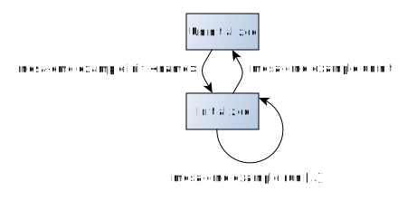

:sectnums:

== Cookbook Examples

This is a collection of examples on how MESA can be used. The purpose of these
example is to document and explain how specific use-cases can be supported.

Typically the examples are simplified to make them easier to understand and to
allow the reader to focus on the MESA functionality instead of general SW
architecture. Following is a listing of limitations/simplifications done on
purpose in the examples:

. Most parameters are hard-coded, and only a few ones can be provided at the
  command-line when activating the examples.
. Error handling is simplified. Typically we wrap all function calls in the `RC`
  macro, which just return in case of error. Many application may want to do
  more sophisticated error handling.
. Only one example can be activated at a time. See the life-cycle section below.
. The examples typically only focus on a simple and specific use-case. When used
  in real application more flexibility is typically needed.

In return, the examples will focus on the following:

. Showing how the MESA functions can be used to configure the Switch core to
  something. Typically it is a frame-forwarding configuration.
. They come pre-integrated in the MESA-DEMO application, meaning that they can
  be _activated_ and tried out on the reference boards.
. Make them as simple as possible, but still ensure that they actually _do_
  something which can be tested and validated by connecting test/network
  equipment to the board running the example.
. When the example are understood, they may be used as a starting point for
  users when building their own applications.

NOTE: The `RC` macro is used in the examples in places where we expect the
function to return `MESA_RC_OK`. If for reasons it fails, then the
`EXAMPLE_FATAL_ERROR` flag is set, and no further interaction with the example
framework is prevented. To recover from this, the board needs to be re-booted.
This would be considered a bug in the example.

=== Example life cycle

All the examples in this section follow this life cycle:

. *Uninitialized:* This is the default state. The example is not active and can
  not do anything.
.. From the *Uninitialized* state the example can be initialized (and going to
   the *Initialized* state) by using the command `mesa-cmd example init <name>
   [example-specific-parameters...]`.
. *Initialized:* In this state the example has been initialized, the base
  configuration has been applied, and test/validation using external equipment
  can start.
.. From this state the example can be uninitialized (and going to the
   *Uninitialized* state) by using the command `mesa-cmd example uninit`. When
   doing this all the configuration done by the example is reverted.
.. While the example is initialized it is also possible to interact with the
   example (if supported by the currently loaded example). To do this use the
   command: `mesa-cmd example run [example-specific-parameters...]`. This is
   useful to check status or to apply further configuration. The example remains
   in the same state.

This is illustrated at the picture below:

[.right.text-center]

NOTE: Only one example can be initialized at a time.

=== Usage example

Like everything else in mesa-demo, all interaction goes through the `mesa-cmd`
command.

Lets see the example help message:

----
# mesa-cmd example
Usage: example [help|list|init|run|uninit] [<args>]
----

Let see the list of implemented examples:

----
# mesa-cmd example list
Known example list:
tas
vlan
stp
evlan
eflow
aggr
----

Lets see the help text of the VLAN command:

----
# mesa-cmd example help vlan
Basic VLAN example
USAGE: vlan uport <value> aport <value> tport <value> hport <value>
Help:
uport: Unaware port, VID 10
aport: Access port, VID 20
tport: Trunk port, VID 10 and 20
hport: Hybrid port, VID 10 (untagged) and VID 20
----

Lets try to initialize it:

----
# mesa-cmd example init vlan uport 1 aport 2 tport 3 hport 4
----

And to uninitialize it:

----
# mesa-cmd example uninit
----

