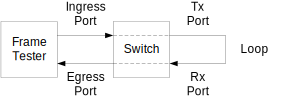

// Copyright (c) 2004-2020 Microchip Technology Inc. and its subsidiaries.
// SPDX-License-Identifier: MIT

:sectnums:

== TSN Frame Preemption Example

The Frame Preemption example is expecting two switch ports to be looped with a cable.
The setup includes the following ports:

* Ingress port: The frame test equipment may send frames into this port.
* Tx port: The looped port with Frame Preemption enabled in the Tx direction.
* Rx port: The looped port receiving frames from the Tx port.
* Egress port: The frame test equipment may receive frames from this port.

The setup uses PVLANs for static forwarding:

* Frames from the ingress port are sent to the Tx port only.
* Frames from the Rx port are sent to the egress port only.

The setup enables Frame Preemption for priority/queue 0 on the Tx port.
On the ingress port, a QCL rule is used to map broadcasts to priority 7.
Therefore, non-broadcast frames received on the ingress port may be preempted by broadcast frames.

