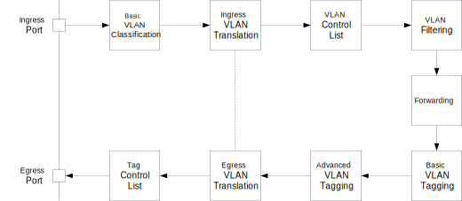
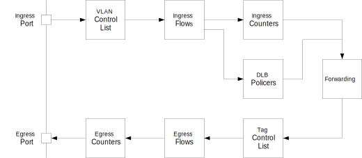
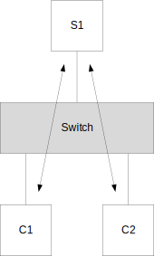
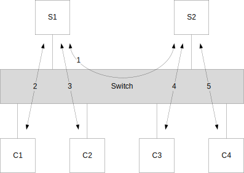

// Copyright (c) 2004-2020 Microchip Technology Inc. and its subsidiaries.
// SPDX-License-Identifier: MIT

:sectnums:
== MAC Address Table
The MAC address table is the Layer 2 forwarding database of the switch.
Each entry is identified by the VLAN ID and the MAC address (`mesa_vid_mac_t`).
For each frame, a learning lookup (VID, SMAC) and a forwarding lookup (VID, DMAC) is done.
By default, automatic learning and aging of addresses is enabled.

=== MAC Address Entry Control
Static entries can be added (`mesa_mac_table_add()`) and deleted (`mesa_mac_table_del()`).
It is possible to specify the egress port set and/or copy matching frames to the CPU (`mesa_mac_table_entry_t`).
Lookup of static and dynamic entries can be done (`mesa_mac_table_get()`).
The table can also be traversed in a sorted manner (`mesa_mac_table_get_next()`).

=== Learning
For each ingress port, the learn mode can be configured (`mesa_learn_mode_t`).
It is possible to enable automatic learning or send learn frames to the CPU for software based learning.

=== Aging
The switch does automatic aging of entries with a configurable age time (`mesa_mac_table_age_time_t`).
It is also possible to do manual age scans (`mesa_mac_table_age()`).

=== Flushing
The API provides a number of functions for flushing dynamic entries per port and/or VID.
For example, when a port goes down, entries learned on the port may be flushed (`mesa_mac_table_port_flush()`).

== Flooding Control
When the forwarding lookup (VID, DMAC) fails, the frame will be flooded. The destination port set for such frames can be configured for different frame types:

* Unicast flood members (`mesa_uc_flood_members_set()`).
* Non-IP multicast data flood members (`mesa_mc_flood_members_set()`).
* IPv4 multicast data flood members (`mesa_ipv4_mc_flood_members_set()`).
* IPv6 multicast data flood members (`mesa_ipv6_mc_flood_members_set()`).

== IPv4 Multicast
If the capability `MESA_CAP_L2_IPV4_MC_SIP` is non-zero, Source Specific Multicast forwarding is supported for IPv4.
In that case, IPv4 multicast forwarding entries per (VID, SIP, DIP) can be added (`mesa_ipv4_mc_add()`) for IGMPv3 snooping.

== IPv6 Multicast
If the capability `MESA_CAP_L2_IPV6_MC_SIP` is non-zero, Source Specific Multicast forwarding is supported for IPv6.
In that case, IPv6 multicast forwarding entries per (VID, SIP, DIP) can be added (`mesa_ipv6_mc_add()`) for MLDv2 snooping.

== Port Operational State
The operational state of each port must be setup when the port goes up/down (`mesa_port_state_set()`).
This controls whether frames are forwarded to/from the port.

== Port Authentication
The IEEE 802.1X authentication state can be setup per port (`mesa_auth_state_t`).

== Port Ingress and Egress Forwarding
It is also possible to control ingress forwarding and/or egress forwarding per port (`mesa_port_forward_t`).

== Spanning Tree

=== Single Spanning Tree
For Single Spanning Tree, the STP state for each port can be controlled (`mesa_stp_port_state_set()`).

=== Multiple Spanning Tree
For Multiple Spanning Tree, each VID can be mapped to an MSTP instance (`mesa_mstp_vlan_msti_set()`).
The MSTP state for each port and instance can be controlled (`mesa_mstp_port_msti_state_set()`).
If the capability `MESA_CAP_L2_MSTP_HW` is zero, VLAN ingress filtering must be enabled on ports running MSTP. 

== VLAN
The VLAN operation involves ingress processing, forwarding (MAC address table) and egress processing as shown below.
The following sections describe the steps in more details.

=== Basic VLAN Classification

Basic VLAN classification operates on the outer tag of the frame, if present.

The VLAN port configuration (`mesa_vlan_port_conf_t`) controls the basic VLAN classification.
The VLAN port type (`mesa_vlan_port_type_t`) field controls the awareness of VLAN tags for an ingress port:

* `MESA_VLAN_PORT_TYPE_UNAWARE`: Unaware of all tags.
* `MESA_VLAN_PORT_TYPE_C`: Aware of C-tags (Ethernet Type 0x8100) 
* `MESA_VLAN_PORT_TYPE_S`: Aware of S-tags (Ethernet Type 0x88a8)
* `MESA_VLAN_PORT_TYPE_S_CUSTOM`: Aware of S-custom-tags (Ethernet Type configurable (`mesa_vlan_conf_t`)).

The basic VLAN classification includes the following:

* Tag classification: Determine whether the frame is considered as untagged or tagged. Tagged frames can be priority-tagged (VID is zero) or VLAN-tagged (VID is non-zero).
* Frame acceptance: Determine whether to allow the frame based on the tag classification.
* VLAN classification: Determine the classified VLAN ID based on the tag classification of the frame.
** Untagged and priority-tagged frames are classified to the Port VLAN ID (PVID).
** VLAN-tagged frames are classified to the VID in the tag.

For frames classified as tagged, the tag pop count is set to 1, indicating that the tag must be popped on egress. +
These classifications depend on the capability `MESA_CAP_L2_TPID_AWARE` as described in the following two sections.

==== Fully VLAN Aware Devices

This section describes the behaviour for devices with a non-zero `MESA_CAP_L2_TPID_AWARE` capability.

* Tag classification:
** Untagged: The port is VLAN unaware or the tag type of the frame does not match the port type (C/S/S-custom).
** Tagged: The port is VLAN aware and the tag type of the frame matches the port type (C/S/S-custom).
* Frame acceptance depends on the VLAN frame type (`mesa_vlan_frame_t`):
** `MESA_VLAN_FRAME_ALL`: All frames are allowed.
** `MESA_VLAN_FRAME_TAGGED`: Only frames classified as VLAN-tagged are allowed.
** `MESA_VLAN_FRAME_UNTAGGED`: Frames classified as VLAN-tagged are discarded.

==== Partially VLAN Aware Devices
This section describes the behaviour for devices with a zero `MESA_CAP_L2_TPID_AWARE` capability. +
For these devices, the tag classification does not distinguish between the tag types (C/S/S-custom).
The frame acceptance distinguishes between C-tags and S-tags/S-custom-tags.

* Tag classification:
** Untagged: The port is VLAN unaware or the tag type of the frame is not C/S/S-custom.
** Tagged: The port is VLAN aware and the tag type of the frame is C/S/S-custom.
* Frame acceptance depends on the VLAN frame type (`mesa_vlan_frame_t`) and port type (`mesa_vlan_port_type_t`):
** `MESA_VLAN_FRAME_ALL`: All frames are allowed.
** `MESA_VLAN_FRAME_TAGGED`:
*** `MESA_VLAN_PORT_TYPE_UNAWARE`: All frames are allowed.
*** `MESA_VLAN_PORT_TYPE_C`: Only C-tagged frames with non-zero VID are allowed.
*** `MESA_VLAN_PORT_TYPE_S`: Only S/S-custom-tagged frames with non-zero VID are allowed.
*** `MESA_VLAN_PORT_TYPE_S_CUSTOM`: Only S/S-custom-tagged frames with non-zero VID are allowed.
** `MESA_VLAN_FRAME_UNTAGGED`:
*** `MESA_VLAN_PORT_TYPE_UNAWARE`: All frames are allowed.
*** `MESA_VLAN_PORT_TYPE_C`: C-tagged frames with non-zero VID are discarded.
*** `MESA_VLAN_PORT_TYPE_S`: S/S-custom-tagged frames with non-zero VID are discarded.
*** `MESA_VLAN_PORT_TYPE_S_CUSTOM`: S/S-custom-tagged frames with non-zero VID are discarded.

=== Ingress VLAN Translation
VLAN translation can be used to translate VLAN IDs between two domains.
The classified VID can be overridden by VLAN translation rules, which can affect both ingress and egress processing.
Configuration of VLAN translation is done in two steps:

* Ports are assigned to VLAN translation groups (`mesa_vlan_trans_port2grp_conf_t`).
* VLAN translation rules (`mesa_vlan_trans_grp2vlan_conf_t`) are added to groups.

Each VLAN translation rule translates between an external VID and an internal VID on the ports in the group.
The translation direction (`mesa_vlan_trans_dir_t`) determines whether to translate on ingress, egress or both.
Ingress VLAN translation is only done on tagged frames.

=== VLAN Control List (VCL)
VLAN Control List (VCL) rules can be used for advanced VLAN classification,
for example protocol-based VLANs. +
The classified VID can be overridden by advanced classification using VCL rules.
Each VLAN Control Entry (VCE) is identified by a VCE ID (`mesa_vce_id_t`). 
The VCEs are ordered in a list of rules based on the VCE IDs.
The first matching rule in the VCL determines the action for a received frame.
When adding a rule, the VCE ID of the rule and the VCE ID of the next rule in
the list must be specified. A special value `MESA_VCE_ID_LAST` is used to
specify that the rule must be added at the end of the list.
Each VCE includes a key structure (`mesa_vce_key_t`) with fields used for
matching received frames and an action structure (`mesa_vce_action_t`) with the
classified VLAN ID. It is also possible to override the tag pop count. +
The VCL port configuration (`mesa_vcl_port_conf_t`) affects the key generated
for frames received on an ingress port. The key type field must be setup
before adding VCE rules including the ingress port.

=== VLAN Filtering
For each VLAN, the port member list can be configured (`mesa_vlan_port_members_set()`).
The port member list for the classified VID is used for VLAN filtering:

* Ingress Filtering: If the ingress port is not a member of the VLAN and VLAN ingress filtering is enabled (`mesa_vlan_port_conf_t` or `mesa_vlan_vid_conf_t`), the frame is discarded.
* Egress Filtering: If an egress port is not a member of the VLAN, the port is removed from the egress port list.

If the capability `MESA_CAP_L2_VLAN_COUNTERS` is non-zero, counters per
classified VLAN are supported (`mesa_vlan_counters_t`). These counters use all
the ingress flow resources of the switch. If the use of ingress flows is
preferred, VLAN counters can be disabled during initialization (`mesa_init_conf_t`).

If the capability `MESA_CAP_L2_SVL_FID_CNT` is non-zero, the switch supports Shared VLAN Learning.
In that case, each VID can be mapped to a FID (`mesa_vlan_vid_conf_t`). The FID will be used instead of the VID in the forwarding process for the learning lookup (VID, SMAC) and the forwarding lookup (VID, DMAC) for unicast MAC addresses.

=== Basic VLAN Tagging
The classified VID and the egress port VLAN configuration (`mesa_vlan_port_conf_t`) determines whether to push a tag.
The untagged VID (UVID) controls the tagging like this:

* UVID == MESA_VID_NULL: Always push a tag.
* UVID == MESA_VID_ALL: Never push a tag.
* UVID == X: Push a tag unless the classified VID is X.

If a tag is pushed, the port type (`mesa_vlan_port_type_t`) of the egress port determines the Ethernet Type of the tag.
For VLAN unaware ports, a C-tag is used.

=== Advanced VLAN Tagging
The decision on whether to push a tag based on the UVID can be overridden (`mesa_vlan_tx_tag_t`) per egress port and classified VID.

=== Egress VLAN Translation
The VLAN translation rules described previously can override the tag push decision per egress port and classified VID.
If an egress translation rule is found, a tag with the external VID is pushed.

=== Tag Control List (TCL)
The egress tagging can be overridden again using Tag Control List (TCL) rules.
Each Tag Control Entry is identified by a TCE ID (`mesa_tce_id_t`).
The TCEs are ordered in a list of rules based on the TCE IDs. 
When adding a rule, the TCE ID of the rule and the TCE ID of the next rule in the list must be specified.
A special value `MESA_TCE_ID_LAST` is used to specify that the rule must be added at the end of the list.
Each TCE can be setup to match frames to an egress port for a classified VID or ingress flow ID (`mesa_tce_key_t`).
For matching frames, it is possible to control the pushing of 0-2 tags (`mesa_tce_action_t`).

== Enhanced VLAN
Enhanced VLAN functionality can be setup as shown below.
In the ingress direction, VCE rules can map to ingress flows mapping to ingress counters and DLB policers.
In the egress direction, TCE rules can map to egress flows mapping to egress counters.
It is also possible to map to ingress/egress QoS mappings and OAM engines (this is not shown below).

=== Ingress Flows
If the capability `MESA_CAP_L2_XFLOW` is non-zero, it is possible to allocate and free ingress flows.
Each flow can be configured to map to a block of ingress counters and a block of DLB policers (`mesa_iflow_conf_t`).

=== Ingress Counters
If the capability `MESA_CAP_L2_XSTAT` is non-zero, it is possible to allocate and free a block of ingress counters.
For example, if an ingress flow is mapped to 4 COSIDs, a block of 4 ingress counter sets is allocated.
The API provides functions to get and clear each counter set (`mesa_ingress_counters_t`). 

=== Dual Leaky Bucket Policers
If the capability `MESA_CAP_L2_XDLB` is non-zero, it is possible to allocate and free a block of Dual Leaky Bucket (DLB) policers. Each policer can be setup for single or dual bucket operation (`mesa_dlb_policer_conf_t`).

=== Egress Flows
If the capability `MESA_CAP_L2_XFLOW` is non-zero, it is possible to allocate and free egress flows.
Each flow can be configured to map to a block of egress counters (`mesa_eflow_conf_t`).

=== Egress Counters
If the capability `MESA_CAP_L2_XSTAT` is non-zero, it is possible to allocate and free a block of egress counters.
For example, if an egress flow is mapped to 2 COSIDs, a block of 2 egress counter sets is allocated.
The API provides functions to get and clear each counter set (`mesa_egress_counters_t`). 

== Port Isolation
Port isolation can be used to restrict forwarding between ports.
If isolation is enabled for both the classified VLAN (`mesa_isolated_vlan_set()`)
and the ingress port (`mesa_isolated_port_members_set()`) of a frame, forwarding
to egress ports with isolation enabled is not allowed. +
In the example below, port isolation is enabled for ports connected to clients
C1 and C2. The clients can communicate with the server S1, but not with each other.

== Private VLAN
Private VLANs can be used to divide ports into groups (`mesa_pvlan_port_members_set()`)
and restrict forwarding independently of traditional VLANs. Forwarding between two ports
is only allowed if both ports are included in at least one common Private VLAN. +
In the example below, ports connected to servers S1 and S1 are in one PVLAN.
Each port connected to a client (C1/C2/C3/C4) is in a PVLAN with one server port.

== Asymmetric Private VLAN
Asymmetric Private VLANs can be used to restrict forwarding independently of
traditional VLANs. For each ingress port it is possible to control which other
egress ports it is allowed to forward to (`mesa_apvlan_port_members_set()`).

== Destination Port Groups

Destination Port Groups (`mesa_dgroup_port_conf_t`) can be used to ensure that
frames are forwarded to all egress ports in the same group.
If two ports map to the same destination group and an egress port set (e.g. for
a MAC address entry) includes one of the ports, both ports will be included in
the resulting destination port set.

== sFlow

Sampling of frame flows (sFlow) can be setup for each port
(`mesa_sflow_port_conf_t`). The desired sample rate should be converted to a
supported sample rate (`mesa_sflow_sampling_rate_convert()`) before enabling
sFlow on a port.

== Link Aggregation
Multiple physical ports can be combined to one logical port using link aggregation (`mesa_aggr_port_members_set()`).
The aggregation mode (`mesa_aggr_mode_t`) of the switch determines how traffic forwarded to link aggregations
is distributed on the physical ports.

== Mirroring

Mirroring can be used to copy frames to a monitor port for network
troubleshooting purposes (`mesa_mirror_conf_t`). Mirroring of frames can be
enabled in multiple ways:

* Per ingress port (`mesa_mirror_ingress_ports_set()`).
* Per egress port (`mesa_mirror_egress_ports_set()`).
* From the CPU (`mesa_mirror_cpu_ingress_set()`).
* To the CPU (`mesa_mirror_cpu_egress_set()`). 
* Per ingress VLAN (`mesa_vlan_vid_conf_t`).
* Per ACL rule or ACL port action (`mesa_acl_action_t`).

== Ethernet Protection Switching

Port protection functions can be used to setup a working port with a protection
port (`mesa_eps_port_conf_t`). The selection of the active port can also be done
(`mesa_eps_selector_t`). The port protection type (`mesa_eps_port_type_t`)
determines the forwarding:

* `MESA_EPS_PORT_1_PLUS_1`:
** Ingress: Frames received on the inactive port are discarded.
** Egress: Frames are forwarded both ports.
* `MESA_EPS_PORT_1_FOR_1`:
** Egress: Frames are only forwarded to the active port.

== Ethernet Ring Protection Switching

Ethernet Ring Protection Switching (ERPS) is based on ring instances
(`mesa_erpi_t`). Each VLAN can be configured to be a member of one or more rings
(`mesa_erps_vlan_member_set()`). The forwarding state (`mesa_erps_state_t`) can
be controlled per ring and port. If a port is discarding for a ring instance,
ingress and egress forwarding will be disabled for all VLANs mapping to the ring
instance. VLAN ingress filtering must be enabled on ports running ERPS.

== Real-time Control List (RCL)

If the capability `MESA_CAP_L2_RCL` is non-zero, the RCL feature is available.
This can be used for special processing of Profinet and OPC-UA frames.
RCL classification can be enabled for a number of VID/PCP values (`mesa_rcl_vid_add()`).
VID zero is used to enable RCL classification for untagged and priority-tagged frames.

Each Real-time Control Entry (RCE) is identified by a RCE ID (`mesa_rce_id_t`).
The RCEs are ordered in a list of rules based on the RCE IDs.
The first matching rule in the RCL determines the action for a received frame.
When adding a rule, the RCE ID of the rule and the RCE ID of the next rule in
the list must be specified. A special value `MESA_RCE_ID_LAST` is used to
specify that the rule must be added at the end of the list.
Each RCE includes a key structure (`mesa_rce_key_t`) with fields used for
matching received frames and an action structure (`mesa_rce_action_t`) with the
resulting forwarding properties.

== API Functions
`mesa_mac_table_add()` +
`mesa_mac_table_del()` +
`mesa_mac_table_get()` +
`mesa_mac_table_get_next()` +
`mesa_mac_table_age_time_get()` +
`mesa_mac_table_age_time_set()` +
`mesa_mac_table_age()` +
`mesa_mac_table_vlan_age()` +
`mesa_mac_table_flush()` +
`mesa_mac_table_port_flush()` +
`mesa_mac_table_vlan_flush()` +
`mesa_mac_table_vlan_port_flush()` +
`mesa_mac_table_status_get()` +
`mesa_learn_port_mode_get()` +
`mesa_learn_port_mode_set()` +
`mesa_uc_flood_members_get()` +
`mesa_uc_flood_members_set()` +
`mesa_mc_flood_members_get()` +
`mesa_mc_flood_members_set()` +
`mesa_ipv4_mc_flood_members_get()` +
`mesa_ipv4_mc_flood_members_set()` +
`mesa_ipv4_mc_add()` +
`mesa_ipv4_mc_del()` +
`mesa_ipv6_mc_flood_members_get()` +
`mesa_ipv6_mc_flood_members_set()` +
`mesa_ipv6_mc_ctrl_flood_get()` +
`mesa_ipv6_mc_ctrl_flood_set()` +
`mesa_ipv6_mc_add()` +
`mesa_ipv6_mc_del()` +
`mesa_port_state_get()` +
`mesa_port_state_set()` +
`mesa_stp_port_state_get()` +
`mesa_stp_port_state_set()` +
`mesa_auth_port_state_get()` +
`mesa_auth_port_state_set()` +
`mesa_mstp_vlan_msti_get()` +
`mesa_mstp_vlan_msti_set()` +
`mesa_mstp_port_msti_state_get()` +
`mesa_mstp_port_msti_state_set()` +
`mesa_vlan_conf_get()` +
`mesa_vlan_conf_set()` +
`mesa_vlan_port_conf_get()` +
`mesa_vlan_port_conf_set()` +
`mesa_vlan_port_members_get()` +
`mesa_vlan_port_members_set()` +
`mesa_vlan_vid_conf_get()` +
`mesa_vlan_vid_conf_set()` +
`mesa_vlan_tx_tag_get()` +
`mesa_vlan_tx_tag_set()` +
`mesa_vlan_counters_get()` +
`mesa_vlan_counters_clear()` +
`mesa_vcl_port_conf_get()` +
`mesa_vcl_port_conf_set()` +
`mesa_vce_init()` +
`mesa_vce_add()` +
`mesa_vce_del()` +
`mesa_ingress_cnt_alloc()` +
`mesa_ingress_cnt_free()` +
`mesa_ingress_cnt_get()` +
`mesa_ingress_cnt_clear()` +
`mesa_dlb_policer_alloc()` +
`mesa_dlb_policer_free()` +
`mesa_dlb_policer_conf_get()` +
`mesa_dlb_policer_conf_set()` +
`mesa_dlb_policer_status_get()` +
`mesa_iflow_alloc()` +
`mesa_iflow_free()` +
`mesa_iflow_conf_get()` +
`mesa_iflow_conf_set()` +
`mesa_tce_init()` +
`mesa_tce_add()` +
`mesa_tce_del()` +
`mesa_egress_cnt_alloc()` +
`mesa_egress_cnt_free()` +
`mesa_egress_cnt_get()` +
`mesa_egress_cnt_clear()` +
`mesa_eflow_alloc()` +
`mesa_eflow_free()` +
`mesa_eflow_conf_get()` +
`mesa_eflow_conf_set()` +
`mesa_vlan_trans_group_add()` +
`mesa_vlan_trans_group_del()` +
`mesa_vlan_trans_group_get()` +
`mesa_vlan_trans_group_get_next()` +
`mesa_vlan_trans_group_to_port_set()` +
`mesa_vlan_trans_group_to_port_get()` +
`mesa_vlan_trans_group_to_port_get_next()` +
`mesa_vcap_port_conf_get()` +
`mesa_vcap_port_conf_set()` +
`mesa_isolated_vlan_get()` +
`mesa_isolated_vlan_set()` +
`mesa_isolated_port_members_get()` +
`mesa_isolated_port_members_set()` +
`mesa_pvlan_port_members_get()` +
`mesa_pvlan_port_members_set()` +
`mesa_apvlan_port_members_get()` +
`mesa_apvlan_port_members_set()` +
`mesa_dgroup_port_conf_get()` +
`mesa_dgroup_port_conf_set()` +
`mesa_sflow_port_conf_get()` +
`mesa_sflow_port_conf_set()` +
`mesa_sflow_sampling_rate_convert()` +
`mesa_aggr_port_members_get()` +
`mesa_aggr_port_members_set()` +
`mesa_aggr_mode_get()` +
`mesa_aggr_mode_set()` +
`mesa_mirror_conf_get()` +
`mesa_mirror_conf_set()` +
`mesa_mirror_monitor_port_get()` +
`mesa_mirror_monitor_port_set()` +
`mesa_mirror_ingress_ports_get()` +
`mesa_mirror_ingress_ports_set()` +
`mesa_mirror_egress_ports_get()` +
`mesa_mirror_egress_ports_set()` +
`mesa_mirror_cpu_ingress_get()` +
`mesa_mirror_cpu_ingress_set()` +
`mesa_mirror_cpu_egress_get()` +
`mesa_mirror_cpu_egress_set()` +
`mesa_eps_port_conf_get()` +
`mesa_eps_port_conf_set()` +
`mesa_eps_port_selector_get()` +
`mesa_eps_port_selector_set()` +
`mesa_erps_vlan_member_get()` +
`mesa_erps_vlan_member_set()` +
`mesa_erps_port_state_get()` +
`mesa_erps_port_state_set()` +
`mesa_rcl_vid_add()` +
`mesa_rcl_vid_del()` +
`mesa_rce_init()` +
`mesa_rce_add()` +
`mesa_rce_del()`
