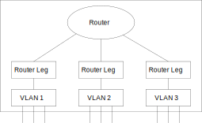

:sectnums:
== Layer 3

Layer 3 forwarding functions for IPv4/IPv6 unicast and multicast are supported
for devices with a non-zero capability `MESA_CAP_L3`. The router forwards IP
frames between router legs based on VLANs. Routed IP frames pass these steps:

* L2 forwarding in ingress VLAN
* L3 forwarding
* L2 forwarding in egress VLAN(s)

=== Global Configuration

Layer 3 forwarding can be enabled/disabled globally for IP unicast and IP
multicast (`mesa_l3_common_conf_t`). The base MAC address used for router legs
can also be setup. This is used as MAC address for all router legs.

=== Router Legs

Layer 3 forwarding is based on router legs (`mesa_l3_rleg_conf_t`). For each
router leg, the classified VLAN ID must be setup and forwarding can be
enabled/disabled for:

* IPv4 unicast
* IPv6 unicast
* IPv4 multicast
* IPv6 multicast

It is also possible to enable up to two VRRP instances (`mesa_l3_vrid_t`) for
each router leg.

=== Unicast Routing

Received IPv4/IPv6 unicast frames matching the router (or VRRP) MAC address and
VID of a router leg are candidates for unicast routing. The destination IP
address is used to lookup a route (`mesa_routing_entry_t`). If a matching route
is found, the next-hop IP address of the route is used to lookup a neighbor
entry (`mesa_l3_neighbour_t`) with the egress VID and DMAC. If the neighbor
lookup is successful, the frame is L3 forwarded by the device. If the route
lookup or the neighbor lookup fails, the frame is redirected to the CPU. It is
up to the CPU to route such frames, including ARP/ND of the next-hop IP address. +
The application may add multiple routes to the same destination network via
different next-hop addresses to support Equal-cost multi-path (ECMP) routing.

=== Multicast Routing

Received IPv4/IPv6 multicast frames matching the VID of a router leg are
candidates for multicast routing. The source and destination IP addresses are
used to lookup a multicast route (`mesa_routing_mc_entry_t`). If a matching
multicast route is found, the frame is forwarded to the egress router legs of
the route. If the multicast route lookup fails, the frame is redirected to the
CPU.

=== Routing Statistics

Routing counters are available per router leg (`mesa_l3_counters_t`).

=== API Functions
`mesa_l3_flush()` +
`mesa_l3_common_get()` +
`mesa_l3_common_set()` +
`mesa_l3_rleg_get_specific()` +
`mesa_l3_rleg_add()` +
`mesa_l3_rleg_update()` +
`mesa_l3_rleg_del()` +
`mesa_l3_route_add()` +
`mesa_l3_route_bulk_add()` +
`mesa_l3_route_del()` +
`mesa_l3_route_bulk_del()` +
`mesa_l3_neighbour_add()` +
`mesa_l3_neighbour_del()` +
`mesa_l3_mc_route_add()` +
`mesa_l3_mc_route_del()` +
`mesa_l3_mc_route_rleg_add()` +
`mesa_l3_mc_route_rleg_del()` +
`mesa_l3_mc_route_active_get()` +
`mesa_l3_counters_reset()` +
`mesa_l3_counters_system_get()` +
`mesa_l3_counters_rleg_get()` +
`mesa_l3_counters_rleg_clear()`
