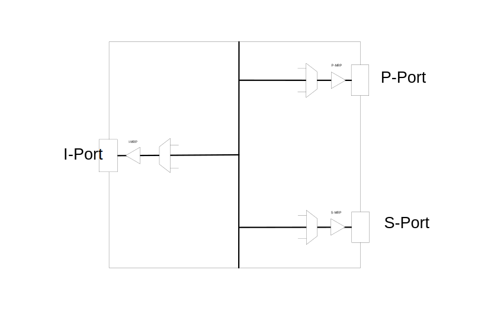

// Copyright (c) 2004-2020 Microchip Technology Inc. and its subsidiaries.
// SPDX-License-Identifier: MIT

:sectnums:

== MRP Functional Description.

MRP is short for Media Redundancy Protocol and covers a range of functionality that determines
the handling of MRP frames at ingress and at egress direction. +
This is according to IEC 62439-2 +

.The frames are containing:
* MRP_Test PDU.
* MRP_TestPropagate PDU.
* MRP_TestMgrNAck PDU.
* MRP_LinkChange PDU.
* MRP_TopologyChange PDU.
* MRP_InTest PDU.
* MRP_InTopologyChange PDU.
* MRP_InLinkChange PDU.
* MRP_InLinkStatusPoll PDU.

.The handling has impact on the frame on ingress:
* Counting MRP_Test and MRP_InTest frames.
* Copying required MRP frames to CPU.
* Controlling forwarding of MRP frames.
* Detection of MRP_Test and MRP_InTest Loss Of Continuity.

.The handling has impact on the frame on egress:
* Updating fields in transmitted MRP_Test and MRP_InTest PDUs

There are MRP HW resources allocated per switch port that support adding and configuration of MRP instances
that can have two ring ports and one interconnected port.

=== MRP Detailed.
The MRP HW resources are hit by MRP frames differently depending of the MRP version.
The following drawing outline the details.

If MESA capability `MESA_CAP_MRP_V0` is not zero the following applies::
The MRP resources are hit automatically, no additional configuration is required.

--
.Frame flow

--

If MESA capability `MESA_CAP_MRP_V1` is not zero the following applies::
The MRP resourced are implemented by VOEs in HW. In order to hit the MRP-VOE the ingress
and injected MRP frames must be directed by additional configuration.

--
.Frame flow

--

=== Adding a MRP.
`mesa_mrp_add()` +
`mesa_mrp_del()` +
The active MRP is handling MRP PDUs on its configured (`mesa_mrp_conf_t`) port. It is initially given
a role in the ring and a role in the possibly interconnected ring.
It can also be configured as a Auto Manager with a priority. +
Handling of MRP PDUs will be depending on the given ring roles according to IEC 62439-2 +
 +
There can only be one MRP instance on a port. +
 +
A MRP instance can be deleted.

=== Getting allocated MRP-VOE indices.
If MESA capability `MESA_CAP_MRP_V1` is not zero the following applies::
`mesa_mrp_voe_index_get()` +
+
When a MRP instance has been added, calling this function will return (`mesa_mrp_voe_idx_t`) the allocated VOE indices to
be used when doing additional configuration required for MRP frames to hit MRP-VOE.

==== Ingress Port VCE and IFLOW.
If MESA capability `MESA_CAP_MRP_V1` is not zero the following applies::
`mesa_vce_add` +
`mesa_iflow_alloc` +
+
On P-Port + S-Port + I-Port one VCE entry is configured (`mesa_vce_t`) with key matching on MRP with no TAG. Action is to mark as MRP and give IFLOW. +
The IFLOW is configured (`mesa_iflow_conf_t`) to point to the allocated MRP-VOE that will be the MRP frame handling VOE. +
The IFLOW is also used as the Egress IFLOW.

==== Egress Port TCE and EFLOW.
If MESA capability `MESA_CAP_MRP_V1` is not zero the following applies::
`mesa_tce_add` +
`mesa_eflow_alloc` +
+
On P-Port + S-Port + I-Port one TCE entry is configured (`mesa_tce_t`) with key matching on specific IFLOW. Action is to give EFLOW. +
The EFLOW is configured (`mesa_eflow_conf_t`) to point to the allocated MRP-VOE that will be the MRP frame handling VOE +
The TCE key IFLOW is used when OAM frames are injected. +
The IFLOW is the same as the one used as Ingress IFLOW.

=== Changing MRP role
`mesa_mrp_ring_role_set()` +
The active MRP can have its ring role changed (`mesa_mrp_ring_role_t`). +
This is required when MRA nodes has to change roles.

.The role has influence on how MRP PDUs are handled regarding:
* Detection of MRP_Test and MRP_InTest Loss Of Continuity
* Forwarding
* Copy to CPU.
This is done according to IEC 62439-2. Required frame are copied to CPU for Protocol Machine implementation. +

=== Swapping Ring Ports
`mesa_mrp_primary_port_set()` +
The active MRP can have its ring ports configuration changed +
This function gives the primary port and the other port in `mesa_mrp_conf_t` becomes secondary port. +
The roles of the ports are automatically inserted into any transmitted MRP_Test PDU.

=== Changing Ring State
`mesa_mrp_ring_state_set()` +
`mesa_mrp_in_ring_state_set()` +
The active MRP can have its ring state changed (`mesa_mrp_ring_state_t`) +
The state of the ring is automatically inserted into any transmitted MRP_Test PDU.

=== Media Redundancy Auto manager
`mesa_mrp_add()` +
`mesa_mrp_ring_role_set()` +
`mesa_mrp_best_mrm_set()` +
`mesa_mrp_tst_copy_conf_set()` +
When the MRP instance is added it can be configured (`mesa_mrp_conf_t`) that it will act as an MRA.
When this is enabled it can either be in Manager or Client ring role. +
 +
Manager Role: +
Any MRP_Test frame received with lower (worse) priority (according to IEC 62439-2) will be copied to CPU for protocol processing. +
The copying of lower (worse) priority frames is enabled by default and can be controlled (`mesa_mrp_tst_copy_conf_t`) by `mesa_mrp_tst_copy_conf_set()` +
If a better Manager is seen the MAC must be configured using `mesa_mrp_best_mrm_set()`. +
Any received MRP_TestMgrNAck PDU is copied to CPU. +
 +
Client Role: +
Calculation of Best MAC MRP_Test frame Loss Of Continuity. +
Any received MRP_TestPropagate PDU is copied to CPU. +

=== Changing Port State
`mesa_mrp_port_state_set()` +
The port state (`mesa_mrp_port_state_t`) in Manager ring role has influence on forwarding of Interconnect
MRP frames between ring ports. +
According to IEC 62439-2 no forwarding should happen.

=== Test PDU Loss Of Continuity
`mesa_mrp_tst_loc_conf_set()` +
`mesa_mrp_status_get()` +
`mesa_mrp_event_mask_set()` +
`mesa_mrp_event_get()` +
The MRP_Test and MRP_InTest frame Loss Of continuity is calculated according to IEC 62439-2
and configured (`mesa_mrp_tst_loc_conf_t`) by `mesa_mrp_tst_loc_conf_set()`. +
The current LOC status (`mesa_mrp_port_status_t`) is fetched by `mesa_mrp_status_get()`. +
The LOC event interrupts can be enabled by `mesa_mrp_event_mask_set()`. +
The latest LOC event pending can be fetched by `mesa_mrp_event_get()`. +
Any pending events are cleared during call to this get(). +

=== Test PDU Copy To CPU when LOC clears
`mesa_mrp_tst_hitme_once` +
`mesa_mrp_itst_hitme_once` +
The receive MRP_Test and MRP_InTest frame that clears active LOC can be copied to CPU.
This is a Hit Me Once that needs to be called after each copy to get the next.

=== Test PDU Copy To CPU
`mesa_mrp_tst_copy_conf_set()` +
The receive MRP_Test and MRP_InTest frame (`mesa_mrp_tst_copy_conf_t`) can be copied to CPU
by `mesa_mrp_tst_copy_conf_set()`. +
In order not to be overwhelmed with remote MRP_[In]Test PDUs this can be turned on and off periodically.

=== Status
`mesa_mrp_status_get()` +
The current MRP status (`mesa_mrp_port_status_t`) is fetched by `mesa_mrp_status_get()`. +

=== Counters
`mesa_mrp_counters_get()` +
`mesa_mrp_counters_clear()` +
The current MRP counters (`mesa_mrp_counters_t`) is fetched by `mesa_mrp_counters_get()`. +
The counters can be cleared by `mesa_mrp_counters_clear()`. +

=== Events
`mesa_mrp_event_mask_set()` +
`mesa_mrp_event_get()` +
The LOC event interrupts can be enabled by `mesa_mrp_event_mask_set()`. +
The latest LOC event pending can be fetched by `mesa_mrp_event_get()`. +
Any pending events are cleared during call to this get(). +

=== MESA functions.
`mesa_mrp_add()` +
`mesa_mrp_get()` +
`mesa_mrp_del()` +
`mesa_mrp_voe_index_get()` +
`mesa_mrp_ring_role_set()` +
`mesa_mrp_primary_port_set()` +
`mesa_mrp_ring_state_set()` +
`mesa_mrp_in_ring_state_set()` +
`mesa_mrp_best_mrm_set()` +
`mesa_mrp_port_state_set()` +
`mesa_mrp_tst_loc_conf_set()` +
`mesa_mrp_tst_hitme_once()` +
`mesa_mrp_itst_hitme_once()` +
`mesa_mrp_tst_copy_conf_set()` +
`mesa_mrp_status_get()` +
`mesa_mrp_counters_get()` +
`mesa_mrp_counters_clear()` +
`mesa_mrp_event_mask_set()` +
`mesa_mrp_event_get()` +
