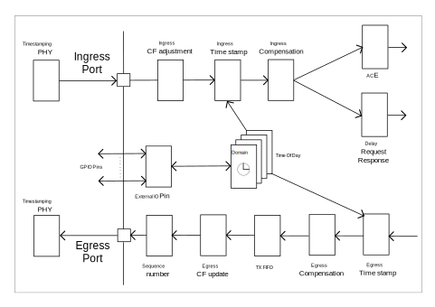

// Copyright (c) 2004-2020 Microchip Technology Inc. and its subsidiaries.
// SPDX-License-Identifier: MIT

:sectnums:

== TS Functional Description.

TS is short for Time Stamping and the API covers a range of functionality that is related to Time stamping of PTP frames at ingress and egress.
Closely related this API is configuring the TOD (Time Of Day) that is the internal PTP clock domain(s) time.
If MESA capability `TS_DELAY_REQ_AUTO_RESP` is not zero this API is configuring a HW support for automatic Delay Request Response generation.

.The configuration has impact on the frame on ingress:
* Give frame classified PTP domain.
* Give frame classified arrival time stamp.
* Adjusting Correction Field.
* Terminate Delay Request frame and generate Delay Request Responce.  (`MESA_CAP_TS_DELAY_REQ_AUTO_RESP`)

.The configuration has impact on the frame on egress:
* Save the PTP message transmission Time Stamp in TX FIFO to be used to implement Two-step PTP instance.
* Update the PTP Message Correction Field to implement One-step PTP instance.
* Update sequence number in PTP message.

=== TS Ingress Detailed.
.Ingress frame flow.

There can be a number of domains that has a clock running the TOD of that domain.
This TOD is used for time stamp operations on both ingress and egress PTP frames classified to a given domain. +
 +
The External IO Pins has different functions that are related to the TOD of a domain. +
 +
An ACL entry action can impact on how a PTP frame is handled/updated at egress. +
 +
Responses to ingress Delay Request messages can be generated automatically (`MESA_CAP_TS_DELAY_REQ_AUTO_RESP`).

==== [#bookmark-tod]#Time Of Day#.
The number of TOD domains is given by MESA capability `MESA_CAP_TS_DOMAIN_CNT`. +
 +
For each supported TOD domain it is possible to configure (`mesa_ts_domain_timeofday_set()`) the current TOD time. +
In the default TOD domain (0) it is possible to configure (`mesa_ts_timeofday_set()`) the current TOD time. +
 +
For each supported TOD domain it is possible to adjust (`mesa_ts_domain_adjtimer_set()`) the clock frequency. +
In the default TOD domain (0) it is possible to adjust (`mesa_ts_adjtimer_set()`) the clock frequency. +
The adjustment can be either negative or positive in parts pr billion +
 +
For each supported TOD domain it is possible to configure (`mesa_ts_domain_timeofday_set_delta()`) a delta time to the currently configured TOD time. +
In the default TOD domain (0) it is possible to configure (`mesa_ts_timeofday_set_delta()`) a delta time to the currently configured TOD time. +
The delta time can be either subtracted or added in Seconds, Nanoseconds and fractions of Nanoseconds to the currently configured TOD time. +
 +
For each supported TOD domain it is possible to configure (`mesa_ts_domain_timeofday_offset_set()`) a offset time to the currently configured TOD time. +
In the default TOD domain (0) it is possible to configure (`mesa_ts_timeofday_offset_set()`) a offset time to the currently configured TOD time. +
The offset time is a signed Nanosecond value that is subtracted from the currently configured TOD time. +

There is a range of possibilities to get TOD per domain::
`mesa_ts_domain_timeofday_get()` +
`mesa_ts_timeofday_get()` +
`mesa_ts_timeofday_next_pps_get()` +
`mesa_ts_timeofday_prev_pps_get()` +
`mesa_ts_domain_timeofday_next_pps_get()` +

See ts.h file for information on what this functions returns exactly.

if `MESA_CHIP_FAMILY_JAGUAR2`::
When an <<bookmark-eca,External Clock>> is configured (`mesa_ts_ext_clock_mode_t`) as one PPS mode (`mesa_ts_ext_clock_one_pps_mode_t`), it is required to call `mesa_ts_adjtimer_one_sec()`
before calling +
`mesa_ts_domain_timeofday_get()` +
`mesa_ts_timeofday_get()` +
`mesa_ts_timeofday_next_pps_get()` +
`mesa_ts_timeofday_prev_pps_get()` +
`mesa_ts_domain_timeofday_next_pps_get()` +
in order to assure reading the latest TOD of the domain addressed.

if `MESA_CHIP_FAMILY_SERVAL`::
It is required to call `mesa_ts_adjtimer_one_sec()` after every one-second timer synchronization pulse interrupt (MEBA_EVENT_SYNC)
in order to make the register configuration happen with parameters given by
`mesa_ts_timeofday_set_delta()` +
`mesa_ts_domain_timeofday_set_delta()` +
`mesa_ts_timeofday_offset_set()`

==== External IO pin (`MESA_CHIP_FAMILY_JAGUAR2` or `MESA_CHIP_FAMILY_SERVALT` or `MESA_CHIP_FAMILY_SPARX5`)
There are 4 External IO pins that can be configured to be related to a TOD Domain.
The External IO pins can be used for generation clock output on a physical GPIO pin or to access/update the TOD related to the pin. +
 +
The The External IO pins are connected to physical GPIO pins after this table: +
 +
`MESA_CHIP_FAMILY_SERVALT` +
External IO pin 0 connected to GPIO pin 10 +
External IO pin 1 connected to GPIO pin 11 +
External IO pin 2 connected to GPIO pin 18 +
External IO pin 3 connected to GPIO pin 19 +
 +
`MESA_CHIP_FAMILY_JAGUAR2` +
External IO pin 0 connected to GPIO pin  8 +
External IO pin 1 connected to GPIO pin  9 +
External IO pin 2 connected to GPIO pin 26 +
External IO pin 3 connected to GPIO pin 27 +
 +
`MESA_CHIP_FAMILY_SPARX5` +
External IO pin 0 connected to GPIO pin  8 +
External IO pin 1 connected to GPIO pin  9 +
External IO pin 2 connected to GPIO pin 24 +
External IO pin 3 connected to GPIO pin 25 +
 +
The TOD get and set function described in <<bookmark-tod,Time Of Day>> is using an External IO pin for accessing TOD. The used pin is depending on the platform: +
`MESA_CHIP_FAMILY_SERVALT` or `MESA_CHIP_FAMILY_SPARX5` +
External IO pin 4 is used for TOD get/set. This is an extra pin not connected to GPIO pin +
 +
`MESA_CHIP_FAMILY_JAGUAR2` +
External IO pin 1 is used for TOD get/set. This pin is connected to GPIO pin and can therefore be shared with other configuration on this pin +

There are different ways to configure these IO pins as described in the following sections.

===== External IO API
This API functions carries a parameter that select the External IO pin. +
 +
An external IO pin can be configured (`mesa_ts_external_io_mode_set()`) to relate to a TOD domain in one of the following modes.

* 'Disabled': IO pin is disabled.
* 'One PPS Output': enable generation of a one PPS pulse based on TOD.
* 'Waveform Output': enable generation of a clock output of a specified frequency based on TOD.
* 'One PPS Input Save': enable save of TOD to get(), at positive edge of input signal.
* 'One PPS Input Load': enable load of set() TOD, at positive edge of input signal.

It is possible to get (`mesa_ts_saved_timeofday_get()`) TOD for the related domain using this External IO pin. +
In case the mode is 'One PPS Input Save' the TOD is what was saved at the last positive edge at input.
It is possible to get TOD as described in <<bookmark-tod,Time Of Day>> +
It is possible to set TOD as described in <<bookmark-tod,Time Of Day>> +
 +
There is no external IO pin TOD set() function. This means that the 'One PPS Input Load' mode cannot be utilized.

===== [#bookmark-eca]#External Clock API#
This API do not carry a parameter that select the External IO pin. +
The External IO pins used are depending on the configured (`mesa_ts_external_clock_mode_set()`) external clock mode. +
The External IO pin is always related to domain 0. +
 +
The external clock can be configured in the following modes.

* 'One PPS Output': enable generation of a one PPS pulse based on TOD. In this case the used External IO pin is 0.
* 'Waveform Output': enable generation of a clock output of a specified frequency based on TOD. In this case the used External IO pin is 0.
* 'One PPS Input Save': enable save of TOD to get(), at positive edge of input signal.
In this case the used External IO pin is 1 (`MESA_CHIP_FAMILY_JAGUAR2` or `MESA_CHIP_FAMILY_SPARX5`) or 4 (`MESA_CHIP_FAMILY_SERVALT`).

It is possible to get TOD as described in <<bookmark-tod,Time Of Day>> +
In case the mode is 'One PPS Input Save' the TOD is what was saved at the last positive edge at input.
It is possible to set TOD as described in <<bookmark-tod,Time Of Day>> +

if `MESA_CHIP_FAMILY_JAGUAR2`::
Note that on this platform the one PPS mode has shared External pin with the pin used for TOD get/set.
When configured as one PPS mode, it is required to call `mesa_ts_adjtimer_one_sec()` in order to assure reading the latest TOD of the domain addressed.

===== Alt Clock API
This API do not carry a parameter that select the External IO pin. +
The External IO pins used are depending on the configured (`mesa_ts_alt_clock_mode_set()`) alternative external clock mode. +
The External IO pin is always related to domain 0. +
 +
The alternative external clock can be configured in the following modes.

* 'One PPS Output': enable generation of a one PPS pulse based on TOD. In this case the used External IO pin is 3.
* 'One PPS Input Save': enable save of TOD to get(), at positive edge of input signal. In this case the used External IO pin is 2.
* 'One PPS Input Load': enable load of set() TOD, at positive edge of input signal. In this case the used External IO pin is 2.

It is possible to get TOD as described in <<bookmark-tod,Time Of Day>> +
In case the mode is 'One PPS Input Save' it is possible to get (`mesa_ts_alt_clock_saved_get()`)
the TOD nanosec counter for domain 0 that was saved at the last positive edge at input. +
 +
It is possible to set TOD as described in <<bookmark-tod,Time Of Day>> +
In case the mode is 'One PPS Input Load' it is possible set (`mesa_ts_timeofday_next_pps_set`)
the TOD to be loaded in domain 0 at the next positive edge at input.

==== External IO pin (`MESA_CHIP_FAMILY_SERVAL`)
There are one TOD domain and there are two External IO pins that can be selected.
The External IO pins can be used for generation clock output on a physical GPIO pin or to access/update the TOD. +
 +
The The External IO pins are connected to physical GPIO pins after this table: +
 +
External IO pin 0 connected to GPIO pin 30 and GPIO pin 31 +
External IO pin 1 connected to GPIO pin 15 and GPIO pin 16 +

There are different ways to configure these IO pins as described in the following sections.

===== External Clock API
The External IO pin used is pin 1 +
 +
The external clock can be configured (`mesa_ts_external_clock_mode_set()`) in the following modes.

* 'One PPS Output': enable generation of a one PPS pulse based on TOD. In this case the used GPIO pin is 16.
* 'Waveform Output': enable generation of a clock output of a specified frequency based on TOD. In this case the used GPIO pin is 16.
* 'One PPS Input Save': enable save of TOD to get(), at positive edge of input signal. In this case the used GPIO pin is 15.

It is possible to get TOD as described in <<bookmark-tod,Time Of Day>> +
In case the mode is 'One PPS Input Save' the TOD is what was saved at the last positive edge at input.
It is possible to set TOD as described in <<bookmark-tod,Time Of Day>> +

===== Alt Clock API
The External IO pin used is pin 0 +
 +
The alternative external clock can be configured (`mesa_ts_alt_clock_mode_set()`) in the following modes.

* 'One PPS Output': enable generation of a one PPS pulse based on TOD. In this case the used GPIO pin is 31.
* 'One PPS Input Save': enable save of TOD to get(), at positive edge of input signal. In this case the used GPIO pin is 30.
* 'One PPS Input Load': enable load of set() TOD, at positive edge of input signal. In this case the used GPIO pin is 30.

It is possible to get TOD as described in <<bookmark-tod,Time Of Day>> +
In case the mode is 'One PPS Input Save' it is possible to get (`mesa_ts_alt_clock_saved_get()`)
the TOD nanosec counter that was saved at the last positive edge at input. +
 +
It is possible to set TOD as described in <<bookmark-tod,Time Of Day>> +
In case the mode is 'One PPS Input Load' it is possible set (`mesa_ts_timeofday_next_pps_set`)
the TOD to be loaded at the next positive edge at input.

==== External IO pin (`MESA_CHIP_FAMILY_OCELOT`)
There are one TOD domain and there are four External IO pins that can be selected.
The External IO pins can be used for generation clock output on a physical GPIO pin or to access/update the TOD. +
 +
The The External IO pins are connected to physical GPIO pins after this table: +
 +
External IO pin 0 connected to GPIO pin 18 +
External IO pin 1 connected to GPIO pin 19 +
External IO pin 2 connected to GPIO pin 10 +
External IO pin 3 connected to GPIO pin 11 +
 +
The TOD get and set function described in <<bookmark-tod,Time Of Day>> is using an External IO pin for accessing TOD. The used pin is 4 +
 +
There are different ways to configure these IO pins as described in the following sections.

===== External Clock API
The External IO pins used are depending on the configured (`mesa_ts_external_clock_mode_set()`) external clock mode. +
 +
The external clock can be configured in the following modes.

* 'One PPS Output': enable generation of a one PPS pulse based on TOD. In this case the used External IO pin is 0.
* 'Waveform Output': enable generation of a clock output of a specified frequency based on TOD. In this case the used External IO pin is 0 and 2.
* 'One PPS Input Save': enable save of TOD to get(), at positive edge of input signal. In this case the used External IO pin is 2.

It is possible to get TOD as described in <<bookmark-tod,Time Of Day>> +
In case the mode is 'One PPS Input Save' the TOD is what was saved at the last positive edge at input.
It is possible to set TOD as described in <<bookmark-tod,Time Of Day>> +

===== Alt Clock API
The External IO pins used are depending on the configured (`mesa_ts_alt_clock_mode_set()`) alternative external clock mode. +
 +
The alternative external clock can be configured in the following modes.

* 'One PPS Output': enable generation of a one PPS pulse based on TOD. In this case the used External IO pin is 0.
* 'One PPS Input Save': enable save of TOD to get(), at positive edge of input signal. In this case the used External IO pin is 3.
* 'One PPS Input Load': enable load of set() TOD, at positive edge of input signal. In this case the used External IO pin is 3.

It is possible to get TOD as described in <<bookmark-tod,Time Of Day>> +
In case the mode is 'One PPS Input Save' it is possible to get (`mesa_ts_alt_clock_saved_get()`)
the TOD nanosec counter for domain 0 that was saved at the last positive edge at input. +
 +
It is possible to set TOD as described in <<bookmark-tod,Time Of Day>> +
In case the mode is 'One PPS Input Load' it is possible set (`mesa_ts_timeofday_next_pps_set`)
the TOD to be loaded in domain 0 at the next positive edge at input.

==== Ingress CF adjustment
At ingress the Correction Fields in PTP messages can be adjusted. The adjustment +++<u>signed</u>+++ value
can be added from register PTP_IDLY1_CFG or PTP_IDLY2_CFG. +
 +
Function `mesa_ts_p2p_delay_set()` is used to configure a +++<u>signed</u>+++ 'PTP delay' per port in the API. +
Function `mesa_ts_delay_asymmetry_set()` is used to configure a +++<u>signed</u>+++ 'PTP asymmetry delay' per port in the API. +
 +
When `mesa_ts_p2p_delay_set()` is called the value of 'PTP delay' plus 'PTP asymmetry delay' is written to register PTP_IDLY2_CFG. +
When `mesa_ts_delay_asymmetry_set()` is called the value of'PTP asymmetry delay' is written to register PTP_IDLY1_CFG. and
the value of 'PTP delay' plus 'PTP asymmetry delay' is written to register PTP_IDLY2_CFG. +
 +
The decision to use this registers and do the actual CF adjustment is done by creating an <<bookmark-ace,ACE>> entry with
the appropriate key and PTP action (`mesa_acl_ptp_action_t`).
The actual adjustment in the frame happens at egress in <<bookmark-ecu,Egress CF update>>

==== Ingress Time Stamp
A port can be configured (`mesa_ts_operation_mode_set()`) to which TOD domain it belongs and if time stamping is done by the switch or by a time stamping PHY. +
If time stamping is done by the PHY it must be configured (`mesa_ts_internal_mode_set()`) what format the time stamp has interfacing to the PHY.
This configuration is common for all ports and must be done before calling `mesa_ts_operation_mode_set()`. +

If the Time stamping is done by the switch an ingress frame gets time stamped based on the domain TOD configured for the port by `mesa_ts_operation_mode_set()`.
This time stamp goes into the IFH of the frame.

==== Ingress Compensation
An ingress latency can be configured (`mesa_ts_ingress_latency_set()`) per port. The latency is subtracted from the time stamp in
the ingress direction to compensate for static delay through the physical encoding layers.

==== [#bookmark-ace]#ACE#
An ACE is an entry in a list that has a key and an action. The list of ACEs is traversed from the top until an entry is found where the frame is matching the key.
The ACE can be configured (`mesa_ace_t`) to affect how a PTP message frame is handled. +
 +
The found ACE PTP action (`mesa_acl_ptp_action_t`) can decide if PTP message Correction Field should be updated and adjusted with ingress or egress delays when transmitted.

There are three possible CF corrections::
Add egress port +++<u>signed</u>+++ PTP_EDLY_CFG register value to CF when transmitted. +
Add ingress port +++<u>signed</u>+++ PTP_IDLY1_CFG register value to CF when transmitted. +
Add ingress port +++<u>signed</u>+++ PTP_IDLY2_CFG register value to CF when transmitted. +
This is used for one step transparent clock.

The found ACE PTP action (`mesa_acl_ptp_action_t`) can decide if PTP message Correction Field should be updated without adjustment when transmitted.
This is used for one step transparent clock. +

The found ACE PTP action (`mesa_acl_ptp_action_conf_t`) can decide if PTP Delay Request message should be handled by an automatic <<bookmark-drr,Delay Request Response>> function .
The function instance can be selected and how the response should be updated. (`MESA_CAP_ACL_SIP_CNT`)

==== [#bookmark-drr]#Delay Request Response  (`MESA_CAP_TS_DELAY_REQ_AUTO_RESP`)#
A number of automatic Delay Request Response functions can be configured (`mesa_ts_autoresp_dom_cfg_set()`).
A PTP Delay Request message can hit the function instance given by <<bookmark-ace,ACE>> PTP action (`mesa_acl_ptp_action_conf_t`). +
 +
Per port an SMAC can be configured (`mesa_ts_smac_set()`) that will be the Response message SMAC
if <<bookmark-ace,ACE>> PTP action is configured (`mesa_acl_ptp_action_conf_t`) to request it. +
 +
How the Delay Request Response is generated depends of a combination of `mesa_ts_autoresp_dom_cfg_t` and `mesa_acl_ptp_action_conf_t` and `mesa_ts_smac_set()`.

==== Egress Time Stamp
A port can be configured (`mesa_ts_operation_mode_set()`) to which TOD domain it belongs and if time stamping is done by the switch or by a time stamping PHY. +
If time stamping is done by the PHY it must be configured (`mesa_ts_internal_mode_set()`) what format the time stamp has interfacing to the PHY.
This configuration is common for all ports and must be done before calling `mesa_ts_operation_mode_set()`. +

If the time stamping is done by the switch an egress frame gets time stamped based on the domain TOD configured for the port by `mesa_ts_operation_mode_set()`.
This time stamp can go to the TX FIFO or be used when calculating the egress CF update and adjustment.

==== Egress Compensation
An egress latency can be configured (`mesa_ts_egress_latency_set()`) per port. The latency is added to the time stamp in
the egress direction to compensate for static delay through the physical encoding layers.

==== TX FIFO
The TX FIFO is able to save a PTP message TX time stamp along with a 'time stamp index' taken from the IFH.
This happens if 'Two step' is signalled in the IFH +
 +
When injecting PTP message from CPU it is possible (`mesa_packet_ptp_action_t`) to signal 'Two Step' in the injected IFH to save TX time stamp in the TX FIFO.
It is also required to allocate (`mesa_tx_timestamp_idx_alloc()`) a 'time stamp index' to go into the IFH.

if `MESA_CHIP_FAMILY_JAGUAR2` or `MESA_CHIP_FAMILY_SERVALT` or `MESA_CHIP_FAMILY_SPARX5`::
In the IFH the RX time stamp is the 'time stamp index'. +
Configuring the IFH RX time stamp is done by setting `mesa_packet_tx_info_t`.ptp_timestamp.

if `MESA_CHIP_FAMILY_SERVAL` or `MESA_CHIP_FAMILY_OCELOT`::
In the IFH the the PTP identifier is the 'time stamp index'. +
Configuring the IFH PTP identifier is done by setting `mesa_packet_tx_info_t`.ptp_id. +

When allocating (`mesa_tx_timestamp_idx_alloc()`) a 'time stamp index' for CPU injection a callback function pointer is given as parameter. +
 +
In order to empty the physical TX FIFO it must periodically be read (`mesa_tx_timestamp_update()`) into API memory.
When reading the TX FIFO, along with any found TX time stamp there is a 'time stamp index' and the
configured call back function is called giving the time stamp. +
 +
The time stamps in the API memory can be removed (`mesa_timestamp_age()`). +

==== [#bookmark-ecu]#Egress CF update#
At egress the Correction Fields in PTP messages can be updated without adjustment. +
 +
At egress the Correction Fields in PTP messages can be updated and adjusted. The +++<u>signed</u>+++ adjustment value can be added from register PTP_EDLY_CFG. +
Function `mesa_ts_delay_asymmetry_set()` is used to configure a +++<u>signed</u>+++ 'PTP asymmetry delay' per port in the API. +
When `mesa_ts_delay_asymmetry_set()` is called the value of 'PTP asymmetry delay' (with negated sign!) is written to register PTP_EDLY_CFG. +
 +
The decision of CF updating and adjustment using this register is done by creating an <<bookmark-ace,ACE>> entry with the appropriate key and PTP action.

==== Sequence Number
At egress a CPU injected PTP SYNC message is updated with an incremented sequence number. There are 256 PTP flows that has individual sequence number counters.
The selected PTP flow counter is determined by the LSB of the the IFH time stamp on the injected SYNC message.
So when SYNC message is injected by CPU the IFH time stamp LSB must be configured to the PTP flow of that SYNC message.

=== MESA functions.
`mesa_ts_timeofday_set()` +
`mesa_ts_domain_timeofday_set()` +
`mesa_ts_timeofday_set_delta()` +
`mesa_ts_domain_timeofday_set_delta()` +
`mesa_ts_timeofday_offset_set()` +
`mesa_ts_domain_timeofday_offset_set()` +
`mesa_ts_adjtimer_one_sec()` +
`mesa_ts_domain_timeofday_get()` +
`mesa_ts_timeofday_get()` +
`mesa_ts_timeofday_next_pps_get()` +
`mesa_ts_timeofday_prev_pps_get()` +
`mesa_ts_domain_timeofday_next_pps_get()` +
`mesa_ts_adjtimer_set()` +
`mesa_ts_domain_adjtimer_set()` +
`mesa_ts_alt_clock_saved_get()` +
`mesa_ts_alt_clock_mode_set()` +
`mesa_ts_timeofday_next_pps_set()` +

== SyncE Functional description
SyncE is short for Synchronous Ethernet. +
If the capability `MESA_CAP_SYNCE` is non-zero, Synchronous Ethernet (ITU-T Rec. G.8262 and related) is supported by enabling recovered clock from a front port to be transmitted on a clock interface:

* After initialization, No recovered clock is transmitted on any clock interface.
* There are`MESA_CAP_SYNCE_CLK_CNT`number of possible clock interfaces.
* Per clock interface the input can be configured (`mesa_synce_clock_in_set()`)
* Per clock interface the output can be configured (`mesa_synce_clock_out_set()`)

=== Possible frequencies
The frequency transmitted on the clock interface depends on a configurable divider parameter (`mesa_synce_divider_t`) and the selected interface speed. This is depending on the chip family.

if `MESA_CHIP_FAMILY_LAN966X`::
Undivided (`MESA_SYNCE_DIVIDER_1`) clock interface frequencies: +
+
[width="50%"]
[cols="1,1"]
|===

| Interface speed     | Frequency
|2.5G                 | 312.5 MHZ
|  1G (CU)            | 125 MHz
|  1G                 | 125 MHz
|===
+
These frequencies can be divided by output configuration (`mesa_synce_divider_t`).

if `MESA_CHIP_FAMILY_SPARX5`::
Undivided (`MESA_SYNCE_DIVIDER_1`) clock interface frequencies: +
+
[width="50%"]
[cols="1,1"]
|===

| Interface speed     | Frequency
| 25G                 | 322.265625 MHz
| 10G                 | 80.56640625 MHz
|  5G (10/25G SERDES) | 40.28320313 MHz
|  5G (6G SERDES)     | 161,1328125 MHz
|2.5G                 | 312.5 MHZ
|  1G                 | 125 MHz
|===
+
These frequencies can be divided by output configuration (`mesa_synce_divider_t`).

if `MESA_CHIP_FAMILY_JAGUAR2`::
Undivided (`MESA_SYNCE_DIVIDER_1`) clock interface frequencies: +
+
[width="50%"]
[cols="1,1"]
|===

| Interface speed     | Frequency
| 10G                 | 161.1328125 MHz
|2.5G (10G SERDES)    | 125 MHZ
|2.5G (6G SERDES)     | 156.25 MHZ
|  1G                 | 125 MHz
|===
+
These frequencies can be divided by output configuration (`mesa_synce_divider_t`).

if `MESA_CHIP_FAMILY_SERVALT`::
Undivided (`MESA_SYNCE_DIVIDER_1`) clock interface frequencies: +
+
[width="50%"]
[cols="1,1"]
|===

| Interface speed     | Frequency
| 10G                 | 161.1328125 MHz
|2.5G (10G SERDES)    | 125 MHZ
|2.5G (6G SERDES)     | 125 MHZ
|  1G                 | 125 MHz
|===
+
These frequencies can be divided by output configuration (`mesa_synce_divider_t`).

if `MESA_CHIP_FAMILY_SERVAL`::
Undivided (`MESA_SYNCE_DIVIDER_1`) clock interface frequencies: +
+
[width="50%"]
[cols="1,1"]
|===

| Interface speed     | Frequency
|2.5G                 | 125 MHZ
|  1G                 | 125 MHz
|===
+
These frequencies can be divided by output configuration (`mesa_synce_divider_t`).

WARNING: Note that the physical clock interface is not designed for frequencies higher that 125 MHZ so a suitable divider must be configured to get below that.

=== MESA Functions
`mesa_synce_clock_in_set()` +
`mesa_synce_clock_in_get()` +
`mesa_synce_clock_out_set()` +
`mesa_synce_clock_out_get()`
