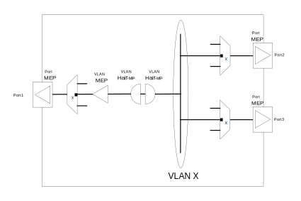
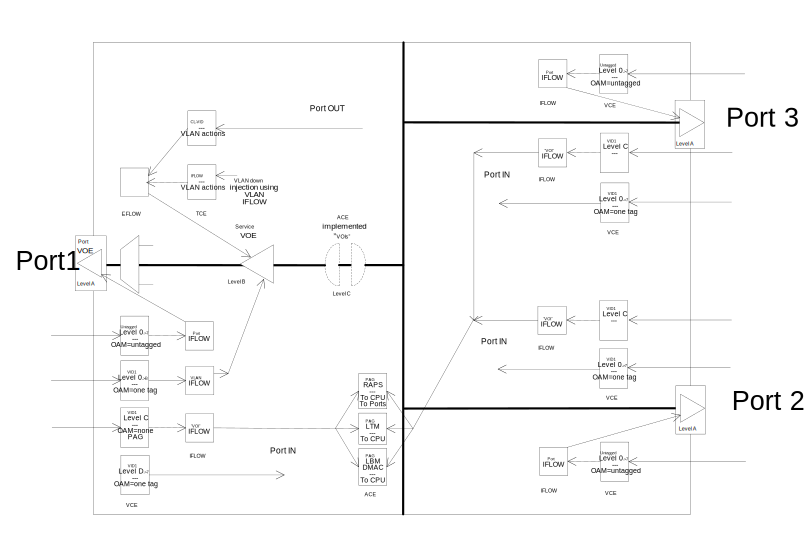
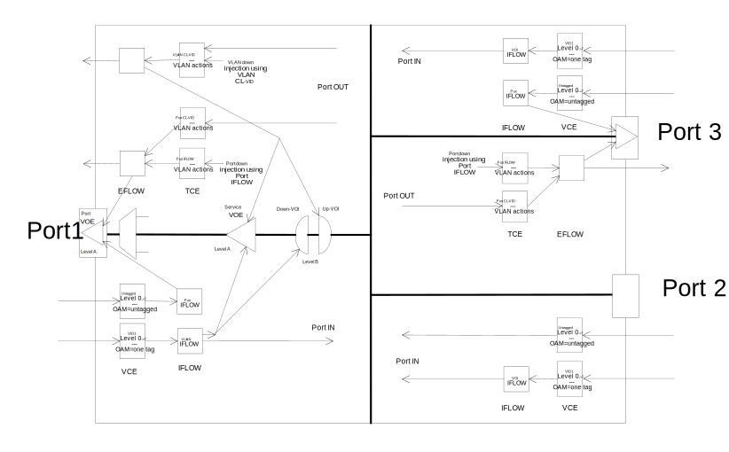

:sectnums:

== VOP Functional Description.

VOP is short for Versatile OAM Processor and covers a range of functionality that determines the handling of OAM frames at ingress and at egress direction. +
OAM is Operations, Administration, and Maintenance based on 802.1Q section 20. +

.The frames are containing:
* CCM PDU.
* LBM/LBR PDU.
* LTM/LTR PDU.
* LAPS PDU.
* RAPS PDU.

.The handling has impact on the frame on ingress:
* MEG level filtering
* Counting frame.
* Copying frame to CPU.
* Frame (CCM) reception rate monitoring.
* Frame (CCM/LBR) sequence number check.
* Frame (RAPS) forward control.
* Frame (LBM) responding.

.The handling has impact on the frame on egress:
* MEG level filtering
* Counting frame.
* Frame (CCM/LBM) updating.

There are VOE (Versatile OAM Endpoint) resources that enable configuration of MEPs. There are two different kinds of VOEs.
Port VOEa are statically allocated one for each port in the switch and a frame can only hit the Port VOE on the ingress and egress port.
Service VOEs are dynamically allocated from a pool and a frame is mapped to hit the VOE at both ingress and egress. +
A Port VOE is only handling a frame as an OAM PDU if it has not hit a Service VOE.

If MESA capability `MESA_CAP_VOP_V2` is not zero the following applies::

There are VOI (Versatile OAM Intermediate) resources that enable configuration of Half-MIPs (MHF).
VOIs are dynamically allocated from a pool and a frame is mapped to hit the VOI at both ingress and egress. +

This is a model of the possible MEP and Half-MIP configuration: +

.MEP and MIP Model

IMPORTANT: In order to implement a MEP or a Half-MIP the Enhanced VLAN API features has to be used. It is required to know and understand the Enhanced VLAN API. +

--
.Configuring and operating a MEP:
. Allocate an OAM-supporting VOE resource.
. Do basic VOE configuration.
. Do OAM feature related VOE configuration.
. Inject OAM frames hitting VOE on egress. +
   Injection of OAM frames can be done using AFI or CPU single frame injection. +
   Hitting a Service VOE requires a TCE entry that maps TX OAM frames to VOE. +
   Hitting a Port VOE requires that the frame did not hit a Service VOE. 
. Extract OAM frames hitting VOE on ingress. +
   Extraction of frames can be controlled through VOE configuration. +
   Hitting a Service VOE requires a VCE entry mapping RX OAM frames to VOE. +
   Hitting a Port VOE requires frame did not hit a Service VOE.
. Event handling. +
   Events from VOE can be enabled or disabled. +
   On interrupt from VOE (or any time) any active event source can be determined.
. Status information. +
   Basic status information can be retrieved. +
   OAM feature status information can be retrieved.
--

If MESA capability `MESA_CAP_VOP_V2` is not zero the following applies::

--
.Configuring and operating a Half-MIP (MHF):
. Allocate an OAM-supporting VOI resource.
. Do VOI configuration.
. Inject OAM frames. +
  Injection of OAM frames can be done using AFI or CPU single frame injection. +
  Hitting a VOI is not required.
. Extract OAM frames hitting VOI on ingress. +
  Extraction of frames can be controlled through VOI configuration. +
  Hitting a Down VOI requires a VCE entry mapping Rx OAM frames to VOI. +
  Hitting an Up VOI requires a VCE entry mapping Rx OAM frames to an ingress
  flow ID and a TCE that matches the ingress flow ID and maps forwarded OAM
  frames to the VOI.
. Event handling. +
  There are no events from VOI.
. Status information. +
  There is no status information from VOI.
--

=== VOP Detailed.
If MESA capability `MESA_CAP_VOP_V1` is not zero the following applies::

--
.Frame flow

--

If MESA capability `MESA_CAP_VOP_V2` is not zero the following applies::

--
.Frame flow

--

==== Active VOE.
The active VOE is doing the level filtering and the OAM processing.

When a frame match a VCE it can be marked as OAM and give an IFLOW that point it to a VOE.
When a frame match a TCE it can give an EFLOW that point it to a VOE.

There are two different kinds of VOEs - a Port VOE and a Service VOE. If an OAM marked frame is pointed to a Service VOE on the right level,
it will become the active VOE.

A frame will always indirectly hit the Port VOE. If an OAM frame is directed to an active Service VOE it also hit the Port VOE afterwards but then only as data.
If an OAM frame is NOT directed to an active Service VOE it will (indirectly) hit the Port VOE as active VOE.

If MESA capability `MESA_CAP_VOP_V2` is not zero the following applies::
VOP-V2 supports <<bookmark-mel,Independent MEL>> meaning it is possible to (indirectly) hit the Port VOE and be handled as data.

==== [#bookmark-mel]#Independent MEL#.
In case of multiple OAM domains (Port and VLAN) ideally there should be independent MEL between the domains, meaning that an OAM frame in the VLAN domain is not level
filtered by a VOE in the Port domain. An OAM frame in the VLAN domain should be handled as data in the port domain.

If MESA capability `MESA_CAP_VOP_V1` is not zero the following applies::
VOP-V1 is not able to mark frame as Independent MEL meaning there is shared MEL between the two domains.

If MESA capability `MESA_CAP_VOP_V2` is not zero the following applies::
If an IFLOW/EFLOW is configured to point to a VOE an OAM marked frame will hit the VOE as NOT Independent MEL, meaning the VOE will be active VOE and do OAM processing. +
+
If an IFLOW/EFLOW is not configured to point to a VOE an OAM marked frame will (indirectly) hit any possible Port VOE as Independent MEL,
meaning the Port VOE will handle the frame as data.

==== Ingress Port VCE and IFLOW.
If MESA capability `MESA_CAP_VOP_V1` is not zero the following applies::
On Port 1-2-3 one VCE entry is configured (`mesa_vce_t`) with key matching on OAM with no TAG and MEG level 0-7. Action is to mark as OAM behind no TAG and give IFLOW. +
The IFLOW is not configured (`mesa_iflow_conf_t`) to point to any Service VOE and therefore it will hit the Port VOE as the OAM handling VOE. +
 +
On Port 1 one VCE entry is configured (`mesa_vce_t`) with key matching on OAM with TAG and MEG level 0-B. Action is to mark as OAM behind one TAG and give IFLOW. +
The IFLOW is configured (`mesa_iflow_conf_t`) to point to an allocated Service VOE on level B that will be the OAM handling VOE. +
 +
On Port 1-2-3 one VCE entry is configured (`mesa_vce_t`) with key matching on OAM with TAG and MEG level C.
Action is to mark as not OAM (to avoid Port VOE OAM handling) and give IFLOW and <<bookmark-ace,MIP-PAG>> value. +
The IFLOW is not configured (`mesa_iflow_conf_t`) to point to an allocated Service VOE. +
If this frame is copied to CPU by the MIP ACE entries the ISDX can be used to identify that it is related to the MIP. +
 +
On Port 2-3 one VCE entry is configured (`mesa_vce_t`) with key matching on OAM with one TAG and MEG level 0-7. Action is to mark as OAM behind one TAG and give IFLOW. +
The IFLOW is not configured (`mesa_iflow_conf_t`) to point to any Service VOE. +
On egress this frame can be level filtered by Service VOE in the flow. +
 +
On Port 1 one VCE entry is configured (`mesa_vce_t`) with key matching on OAM with one TAG and MEG level D-7. Action is to mark as OAM behind one TAG and give IFLOW. +
The IFLOW is not configured (`mesa_iflow_conf_t`) to point to any Service VOE. +
On egress this frame can be level filtered by Service VOE in the flow. +

IMPORTANT: Note that VOP-V1 is not able to mark frame as Independent MEL. An VLAN OAM frame marked as OAM and not hitting a Service VOE will hit the Port VOE for OAM handling.
Therefore there are shared MEL between the Port and VLAN domain and the Port VOE must be on lower level than any VLAN Service VOE +

If MESA capability `MESA_CAP_VOP_V2` is not zero the following applies::
On Port 1+3 one VCE entry is configured (`mesa_vce_t`) with key matching on OAM with no TAG and MEG level 0-7. Action is to mark as OAM behind no TAG and give IFLOW. +
The IFLOW is configured (`mesa_iflow_conf_t`) to point to the allocated Port VOE that will be the OAM handling VOE.
The Port VOE might be on level lower than 7 meaning that unhandled OAM frames are forwarded marked as OAM, enabling possible level filtering on egress +
 +
On Port 2 one VCE entry is configured (`mesa_vce_t`) with key matching on OAM with no TAG and MEG level 0-7. Action is to mark as OAM behind no TAG.
On egress this frame can be level filtered. +
 +
On Port 1 one VCE entry is configured (`mesa_vce_t`) with key matching on OAM with TAG and MEG level 0-7. Action is to mark as OAM behind one TAG and give IFLOW. +
The IFLOW is configured (`mesa_iflow_conf_t`) to point to an allocated Service VOE and Down-VOI that will be the OAM handling VOE/VOI.
The Service VOE might be on level lower than 7 meaning that unhandled OAM frames are forwarded marked as OAM, enabling possible level filtering on egress +
 +
On Port 2-3 one VCE entry is configured (`mesa_vce_t`) with key matching on OAM with one TAG and MEG level 0-7. Action is to mark as OAM behind one TAG and give IFLOW. +
The IFLOW is not configured (`mesa_iflow_conf_t`) to point to any VOE. This assure marking the frame is as Independent MEL on ingress to avoid Port VOE as a OAM handling VOE. +
On egress this frame can be handled by Up-VOI or level filtered by Service VOEs in the flow. +
If this frame is copied to CPU by the Up-MIP the ISDX can be used to identify that it is related to that Up-MIP. +

==== Egress Port TCE and EFLOW.
If MESA capability `MESA_CAP_VOP_V1` is not zero the following applies::
On Port 1 one TCE entry is configured (`mesa_tce_t`) with key matching on specific IFLOW. Action is to give TAG as the E/VLAN that the VLAN MEP resides and to give EFLOW. +
The EFLOW is configured (`mesa_eflow_conf_t`) to point to an allocated Service VOE that will be the OAM handling VOE. +
The TCE key IFLOW is used when OAM frames are injected and configured (`mesa_voe_conf_t`) in the VOE as the loop IFLOW. +
+
On Port 1 one TCE entry is configured (`mesa_tce_t`) with key matching on classified VID of the E/VLAN that the MEP resides. Action is to give TAG as the E/VLAN that the MEP resides and to give EFLOW. +
The EFLOW is configured (`mesa_eflow_conf_t`) to point to an allocated Service VOE that will be the OAM handling VOE. +

If MESA capability `MESA_CAP_VOP_V2` is not zero the following applies::
IMPORTANT: Note that on all ports by default all frames are marked as Independent MEL on egress. This means that any frame marked as OAM on ingress will be
handled as data (not OAM) by any Port VOE on egress. +
+
On Port 1 one TCE entry is configured (`mesa_tce_t`) with key matching on classified VID of the VLAN flow.
Action is to give TAG as the E/VLAN that the VLAN MEP resides and to give EFLOW. +
The EFLOW is configured (`mesa_eflow_conf_t`) to point to an allocated Service VOE ans Service MIP that will be the OAM handling VOE/MIP. +
The TCE key VID is used when OAM frames are injected and is also matched by forwading frames for level filtering +
+
On Port 1+3 one TCE entry is configured (`mesa_tce_t`) with key matching on specific IFLOW. Action is to control tagging of the Port MEP and to give EFLOW. +
The EFLOW is configured (`mesa_eflow_conf_t`) to point to the Port VOE in order to mark injected OAM frames as NOT Independent MEL.
This means injected frames are handled as OAM by the Port VOE. +
The TCE key IFLOW is used when OAM frames are injected and configured (`mesa_voe_conf_t`) in the VOE as the loop IFLOW. +
+
On Port 1+3 one TCE entry is configured (`mesa_tce_t`) with key matching on classified VID of the VLAN that the Port MEP resides.
Action is to control tagging of the Port MEP and to give EFLOW. +
The EFLOW is configured (`mesa_eflow_conf_t`) to point to the Port VOE in order to mark forwarded OAM frames as NOT Independent MEL.
This means forwarded frames are handled as OAM by the Port VOE for level filtering. +

==== [#bookmark-ace]#ACE#.
If MESA capability `MESA_CAP_VOP_V1` is not zero the following applies::
On Port 2-3 one ACE entry is configured (`mesa_ace_t`) with key matching on MIP-PAG value and opcode RAPS (and RAPS MC-MAC). Action is to control copy to CPU and forwarding. +
 +
On Port 2-3 one ACE entry is configured (`mesa_ace_t`) with key matching on MIP-PAG value and opcode LTM (and Class-2 MC-MAC). Action is to control copy to CPU and forwarding. +
 +
On Port 2-3 one ACE entry is configured (`mesa_ace_t`) with key matching on MIP-PAG value and opcode LBM (and Class-2 MC-MAC). Action is to control copy to CPU and forwarding. +

==== VOP.
The VOP common attributes are configured (`mesa_vop_conf_t`)

==== VOE.
The Port and Services VOEs are allocated (`mesa_voe_allocation_t`) and basic attributes are configured (`mesa_voe_conf_t`). +
The VOE OAM functionality can be configured (`mesa_voe_cc_conf_t` and `mesa_voe_lt_conf_t` and `mesa_voe_lb_conf_t` and `mesa_voe_laps_conf_t`) +

If MESA capability `MESA_CAP_VOP_V1` is not zero the following applies::
Note that VOP-V1 is not able to mark frame as Independent MEL. Therefore the Port VOE must be on lower level than any Service VOE in the same flow.

==== VOI.
If MESA capability `MESA_CAP_VOP_V2` is not zero the following applies::
The VOIs are allocated (`mesa_voi_allocation_t`) and basic attributes and OAM functionality are configured (`mesa_voi_conf_t`). +

=== MESA functions.
`mesa_vce_init()` +
`mesa_vce_add()` +
`mesa_iflow_alloc()` +
`mesa_iflow_conf_set()` +
`mesa_iflow_conf_set()` +
`mesa_tce_init()` +
`mesa_tce_add()` +
`mesa_eflow_alloc()` +
`mesa_eflow_conf_set()` +
`mesa_eflow_conf_set()` +
`mesa_vop_conf_set()` +
`mesa_voe_alloc()` +
`mesa_voe_conf_set()` +

If MESA capability `MESA_CAP_VOP_V2` is not zero the following applies::
`mesa_voi_alloc()` +
`mesa_voi_conf_set()` +

